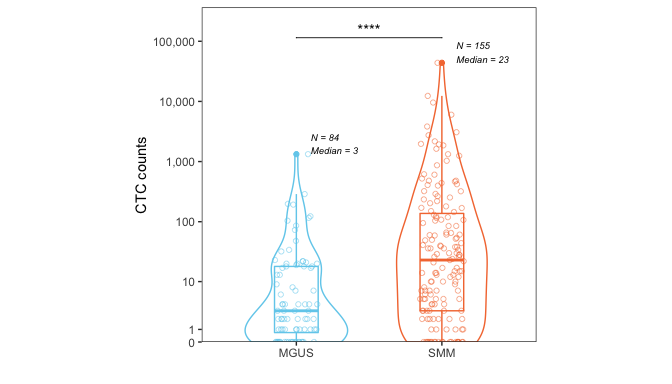
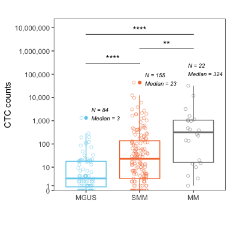
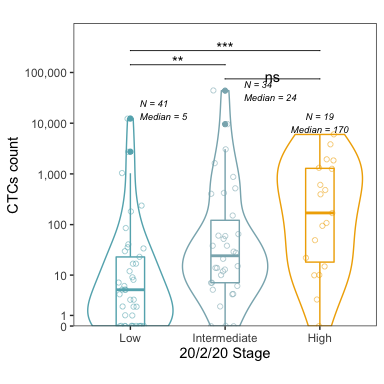
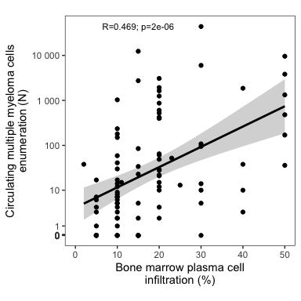
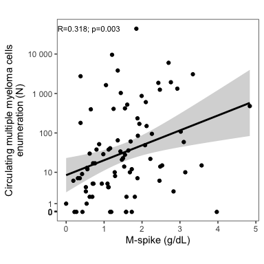

# Enumeration


```r
library(tidyverse)
library(RColorBrewer)
library(cowplot)
library(readxl)
library(circlize)
library(ggpubr)
library(broom)

source("../0_utils/utils.R")
```


```r
precursor_cmmcs_counts <- read.csv("data/precursorcmmc_counts_revisions.csv")
smm_cmmcs_risk20220 <- read.csv("data/smmcmmc_20220risk revisions.csv")
counts_with_mm <- read.csv("data/mgus_smm_mm_counts_revisions.csv")

mgus.smm.palette <- c("MGUS" = "#72cfed", "SMM" = "#f4793f") # original ankit
mgus.smm.mm.palette <- c("MGUS" = "#72cfed", "SMM" = "#f4793f", "MM" = "darkgreen") # original ankit
smm.palette <- c("Low"="#64B1BB", "Intermediate"="#8AB2BB", "High"="#F0AD00")
```


## MGUS vs SMM


```r
basic.stat <- precursor_cmmcs_counts |>
  summarise(N_nonzero = sum(CellRescue>0),
            N_zero = sum(CellRescue==0),
            PCT_zero = percent(N_zero/n()),
            N_nonzero_MGUS = sum(CellRescue>0 & Stage=="MGUS"),
            PCT_NON_ZERO_MGUS = sum(CellRescue>0 & Stage=="MGUS")/sum(Stage=="MGUS"),
            PCT_NON_ZERO_SMM = sum(CellRescue>0 & Stage=="SMM")/sum(Stage=="SMM"),
            N_nonzero_SMM = sum(CellRescue>0 & Stage=="SMM"),
            N_participants = n(),
            N_SMM=sum(Stage=="SMM"),
            N_MGUS=sum(Stage=="MGUS"),
            N_5=sum(CellRescue>=5),
            PCT_5=percent(N_5/n()),     
            N_5_SMM=sum(CellRescue>=5 & Stage=="SMM"),
            PCT_5_SMM=percent(N_5_SMM / sum(Stage=="SMM")),
            N_5_MGUS=sum(CellRescue>=5 & Stage=="MGUS"),
            PCT_5_MGUS=percent(N_5_MGUS / sum(Stage=="MGUS")),
            N_50=sum(CellRescue>=50),
            PCT_50=percent(N_50/n()),
            N_300=sum(CellRescue>=300),
            PCT_300=percent(N_300/n()),
            N_50_SMM=sum(CellRescue>=50 & Stage=="SMM"),
            PCT_50_SMM=percent(N_50_SMM / sum(Stage=="SMM")),
            N_300_SMM=sum(CellRescue>=300 & Stage=="SMM"),
            PCT_300_SMM=percent(N_300_SMM/ sum(Stage=="SMM")),
            N_50_MGUS=sum(CellRescue>=50 & Stage=="MGUS"),
            PCT_50_MGUS=percent(N_50_MGUS / sum(Stage=="MGUS")),
            N_300_MGUS=sum(CellRescue>=300 & Stage=="MGUS"),
            PCT_300_MGUS=percent(N_300_MGUS/ sum(Stage=="MGUS")))

basic.stat
```

<div class="kable-table">

<table>
 <thead>
  <tr>
   <th style="text-align:right;"> N_nonzero </th>
   <th style="text-align:right;"> N_zero </th>
   <th style="text-align:left;"> PCT_zero </th>
   <th style="text-align:right;"> N_nonzero_MGUS </th>
   <th style="text-align:right;"> PCT_NON_ZERO_MGUS </th>
   <th style="text-align:right;"> PCT_NON_ZERO_SMM </th>
   <th style="text-align:right;"> N_nonzero_SMM </th>
   <th style="text-align:right;"> N_participants </th>
   <th style="text-align:right;"> N_SMM </th>
   <th style="text-align:right;"> N_MGUS </th>
   <th style="text-align:right;"> N_5 </th>
   <th style="text-align:left;"> PCT_5 </th>
   <th style="text-align:right;"> N_5_SMM </th>
   <th style="text-align:left;"> PCT_5_SMM </th>
   <th style="text-align:right;"> N_5_MGUS </th>
   <th style="text-align:left;"> PCT_5_MGUS </th>
   <th style="text-align:right;"> N_50 </th>
   <th style="text-align:left;"> PCT_50 </th>
   <th style="text-align:right;"> N_300 </th>
   <th style="text-align:left;"> PCT_300 </th>
   <th style="text-align:right;"> N_50_SMM </th>
   <th style="text-align:left;"> PCT_50_SMM </th>
   <th style="text-align:right;"> N_300_SMM </th>
   <th style="text-align:left;"> PCT_300_SMM </th>
   <th style="text-align:right;"> N_50_MGUS </th>
   <th style="text-align:left;"> PCT_50_MGUS </th>
   <th style="text-align:right;"> N_300_MGUS </th>
   <th style="text-align:left;"> PCT_300_MGUS </th>
  </tr>
 </thead>
<tbody>
  <tr>
   <td style="text-align:right;"> 197 </td>
   <td style="text-align:right;"> 42 </td>
   <td style="text-align:left;"> 18% </td>
   <td style="text-align:right;"> 63 </td>
   <td style="text-align:right;"> 0.75 </td>
   <td style="text-align:right;"> 0.8645161 </td>
   <td style="text-align:right;"> 134 </td>
   <td style="text-align:right;"> 239 </td>
   <td style="text-align:right;"> 155 </td>
   <td style="text-align:right;"> 84 </td>
   <td style="text-align:right;"> 143 </td>
   <td style="text-align:left;"> 60% </td>
   <td style="text-align:right;"> 111 </td>
   <td style="text-align:left;"> 72% </td>
   <td style="text-align:right;"> 32 </td>
   <td style="text-align:left;"> 38% </td>
   <td style="text-align:right;"> 67 </td>
   <td style="text-align:left;"> 28% </td>
   <td style="text-align:right;"> 29 </td>
   <td style="text-align:left;"> 12% </td>
   <td style="text-align:right;"> 58 </td>
   <td style="text-align:left;"> 37% </td>
   <td style="text-align:right;"> 28 </td>
   <td style="text-align:left;"> 18% </td>
   <td style="text-align:right;"> 9 </td>
   <td style="text-align:left;"> 11% </td>
   <td style="text-align:right;"> 1 </td>
   <td style="text-align:left;"> 1% </td>
  </tr>
</tbody>
</table>

</div>

### Count distribution and non-zero counts in MGUS / SMM


```r
# for crossover
fig.bar.rescue.number.crossover <- precursor_cmmcs_counts |>
  mutate(Patient=fct_reorder(as.factor(Patient), -CellRescue)) |>
  ggplot(aes(fct_reorder(Patient, -CellRescue), CellRescue,  fill = Stage)) +
  geom_bar(stat = "identity", width = 1) +
   geom_segment(x = basic.stat$N_nonzero+1, xend = basic.stat$N_participants, y=.2, yend=.2,  size=.2) +
   annotate(geom = "text", x = 1/2*(basic.stat$N_nonzero+1+basic.stat$N_participants), y=3, label=paste0(basic.stat$PCT_zero, "\nwithout\ncells"), size=2.5) +
  scale_fill_manual(values=mgus.smm.palette) +
  scale_y_continuous(trans = "pseudo_log",
                     breaks = int.breaks,
                     minor_breaks = minor_breaks, 
                     labels = function(x) format(x, big.mark = ",", scientific = FALSE),
                     expand = expansion(mult = c(0, 0.1))) +
  scale_x_discrete(expand = expansion(add = c(2, 0))) +
  labs(x=paste0("Participant (n=", basic.stat$N_participants, ")"), y="CTCs count") +
  theme_bw() +
  theme(panel.grid = element_blank(),
        legend.position = c(.8, .8),
        aspect.ratio = 1,
        axis.ticks.x = element_blank(),
        axis.text.x = element_blank())
fig.bar.rescue.number.crossover
```

<!-- -->

# Density graph for enumeration at MGUS / SMM stages


```r
qts <- c(0, .25, .5, .75, 1)
qts.stat <- precursor_cmmcs_counts |>
  group_by(Stage) |>
  summarise(qts=qts, y=quantile(CellRescue, qts))

mgus.median.label = paste0("N = ", basic.stat$N_MGUS, "\nMedian = ", pull(subset(qts.stat, Stage=="MGUS" & qts==0.5), y))
mgus.median.y = 1.5*pull(subset(qts.stat, Stage=="MGUS" & qts==1), y)

smm.median.label = paste0("N = ", basic.stat$N_SMM, "\nMedian = ", pull(subset(qts.stat, Stage=="SMM" & qts==0.5), y))
smm.median.y = 1.5*pull(subset(qts.stat, Stage=="SMM" & qts==1), y)

fig.violin.rescue.number <- precursor_cmmcs_counts |>
  mutate(Patient=fct_reorder(as.factor(Patient), -CellRescue)) |>
  ggplot(aes(Stage, CellRescue, color=Stage)) +
  geom_violin(scale = "count", adjust=1, width=1.3) +
  geom_jitter(width=0.15, shape=21, alpha=0.5) +
  geom_boxplot(width=0.3, fill=NA) +
  annotate(geom = "text", x = 1.1, label=mgus.median.label, y=mgus.median.y, size=2.5, fontface = 'italic', hjust=0) +
  annotate(geom = "text", x = 2.1, label=smm.median.label, y=smm.median.y, size=2.5, fontface = 'italic', hjust=0) +
  scale_y_continuous(trans = "pseudo_log",
                     breaks = int.breaks,
                     minor_breaks = minor_breaks, 
                     labels = function(x) format(x, big.mark = ",", scientific = FALSE),
                     expand = expansion(mult = c(0, 0.1))) +
  scale_color_manual(values = mgus.smm.palette) +
  labs(x="", y="CTC counts") +
  theme_bw() +
  theme(panel.grid = element_blank(),
        legend.position = "none",
        aspect.ratio = 1) +
  stat_compare_means(comparisons = list(c("MGUS", "SMM")), hide.ns = TRUE, label = "p.format", tip.length = 0, symnum.args=symnum.args)

# p.fig1bc <- plot_grid(fig.bar.rescue.number, fig.violin.rescue.number, axis = "btlr", align = "hv")
p.fig1bc <- plot_grid(fig.bar.rescue.number.crossover, fig.violin.rescue.number, axis = "btlr", align = "hv")

print(fig.violin.rescue.number)
```

<!-- -->

```r
ggsave2("figures/Fig1bc.pdf", p.fig1bc, width = 7, height = 4)
ggsave2("figures/Fig1bc.png", p.fig1bc, width = 7, height = 4, units = "in")
```

## Compared enumeration of MGUS, SMM, and overt Multiple Myelomas


```r
basic.stat.mm <- counts_with_mm |>
  summarise(N_participants = n(),
            N_SMM=sum(Stage=="SMM"),
            N_MGUS=sum(Stage=="MGUS"),
            N_MM=sum(Stage=="MM"))
qts <- c(0, .25, .5, .75, 1)
qts.stat.mm <- counts_with_mm |>
  group_by(Stage) |>
  summarise(qts=qts, y=quantile(CellRescue, qts))

mgus.median.label = paste0("N = ", basic.stat.mm$N_MGUS, "\nMedian = ", pull(subset(qts.stat.mm, Stage=="MGUS" & qts==0.5), y))
mgus.median.y = 1.5*pull(subset(qts.stat.mm, Stage=="MGUS" & qts==1), y)

smm.median.label = paste0("N = ", basic.stat.mm$N_SMM, "\nMedian = ", pull(subset(qts.stat.mm, Stage=="SMM" & qts==0.5), y))
smm.median.y = 1.4*pull(subset(qts.stat.mm, Stage=="SMM" & qts==1), y)

mm.median.label = paste0("N = ", basic.stat.mm$N_MM, "\nMedian = ", round(pull(subset(qts.stat.mm, Stage=="MM" & qts==0.5), y)))
mm.median.y = 5*pull(subset(qts.stat.mm, Stage=="MM" & qts==1), y)


fig.violin.rescue.number.supp.mm <- counts_with_mm |>
  mutate(Patient=fct_reorder(as.factor(Patient), -CellRescue)) |>
  mutate(Stage=factor(Stage, levels=c("MGUS", "SMM", "MM"))) |>
  ggplot(aes(Stage, CellRescue, color=Stage)) +
  geom_jitter(width=0.15, shape=21, alpha=0.5) +
  geom_boxplot(width=0.75, fill=NA) +
  annotate(geom = "text", x = 1.1, label=mgus.median.label, y=mgus.median.y, size=2.5, fontface = 'italic', hjust=0) +
  annotate(geom = "text", x = 2.1, label=smm.median.label, y=smm.median.y, size=2.5, fontface = 'italic', hjust=0) +
  annotate(geom = "text", x = 2.9, label=mm.median.label, y=mm.median.y, size=2.5, fontface = 'italic', hjust=0) +
  scale_y_continuous(trans = "pseudo_log",
                     breaks = int.breaks,
                     minor_breaks = minor_breaks, 
                     labels = function(x) format(x, big.mark = ",", scientific = FALSE),
                     expand = expansion(mult = c(0, 0.1))) +
  scale_color_manual(values = mgus.smm.palette) +
  labs(x="", y="CTC counts") +
  theme_bw() +
  theme(panel.grid = element_blank(),
        legend.position = "none",
        aspect.ratio = 1) +
  stat_compare_means(comparisons = list(c("MGUS", "SMM"), c("SMM", "MM"), c("MGUS", "MM")), hide.ns = TRUE, label = "p.format", tip.length = 0, symnum.args=symnum.args)

print(fig.violin.rescue.number.supp.mm)
```

<!-- -->

```r
ggsave2("figures/FigSuppRevMM.pdf", fig.violin.rescue.number.supp.mm, width = 4, height = 4)
ggsave2("figures/FigSuppRevMM.png", fig.violin.rescue.number.supp.mm, width = 4, height = 4, units = "in")
```

## Clinical staging in SMM by 20.2.20 and enumeration


```r
smm_cmmcs_risk20220.clean <- smm_cmmcs_risk20220 %>%
  mutate(CellRescue=as.numeric(CellRescue)) %>%
  filter(ID!="MN0084" & X20.2.20.stage!="") %>% # this patient had unsufficient material for enumeration
  mutate(X20.2.20.stage=factor(X20.2.20.stage, levels = c("Low", "Intermediate", "High")))

N.stat.smm <- smm_cmmcs_risk20220.clean |>
  group_by(X20.2.20.stage) |>
  summarise(N=n()) |>
  as.matrix()
qts.stat.smm <- smm_cmmcs_risk20220.clean |>
  group_by(X20.2.20.stage) |>
  summarise(qts=qts, y=quantile(CellRescue, qts))

low.label = paste0("N = ", N.stat.smm[1,2], "\nMedian = ", round(pull(subset(qts.stat.smm, X20.2.20.stage=="Low" & qts==0.5), y)))
low.y = 1.5*pull(subset(qts.stat.smm, X20.2.20.stage=="Low" & qts==1), y)

int.label = paste0("N = ", N.stat.smm[2,2], "\nMedian = ",round( pull(subset(qts.stat.smm, X20.2.20.stage=="Intermediate" & qts==0.5), y)))
int.y = 1*pull(subset(qts.stat.smm, X20.2.20.stage=="Intermediate" & qts==1), y)

high.label = paste0("N = ", N.stat.smm[3,2], "\nMedian = ", round(pull(subset(qts.stat.smm, X20.2.20.stage=="High" & qts==0.5), y)))
high.y = 1.7*pull(subset(qts.stat.smm, X20.2.20.stage=="High" & qts==1), y)

# same p val class
smm_cmmcs_risk20220.clean %>%
  ungroup() %>%
  wilcox_test(CellRescue~X20.2.20.stage) %>%
  adjust_pvalue()
```

<div class="kable-table">

<table>
 <thead>
  <tr>
   <th style="text-align:left;"> .y. </th>
   <th style="text-align:left;"> group1 </th>
   <th style="text-align:left;"> group2 </th>
   <th style="text-align:right;"> n1 </th>
   <th style="text-align:right;"> n2 </th>
   <th style="text-align:right;"> statistic </th>
   <th style="text-align:right;"> p </th>
   <th style="text-align:right;"> p.adj </th>
   <th style="text-align:left;"> p.adj.signif </th>
  </tr>
 </thead>
<tbody>
  <tr>
   <td style="text-align:left;"> CellRescue </td>
   <td style="text-align:left;"> Low </td>
   <td style="text-align:left;"> Intermediate </td>
   <td style="text-align:right;"> 41 </td>
   <td style="text-align:right;"> 34 </td>
   <td style="text-align:right;"> 413 </td>
   <td style="text-align:right;"> 0.002000 </td>
   <td style="text-align:right;"> 0.004000 </td>
   <td style="text-align:left;"> ** </td>
  </tr>
  <tr>
   <td style="text-align:left;"> CellRescue </td>
   <td style="text-align:left;"> Low </td>
   <td style="text-align:left;"> High </td>
   <td style="text-align:right;"> 41 </td>
   <td style="text-align:right;"> 19 </td>
   <td style="text-align:right;"> 150 </td>
   <td style="text-align:right;"> 0.000134 </td>
   <td style="text-align:right;"> 0.000402 </td>
   <td style="text-align:left;"> *** </td>
  </tr>
  <tr>
   <td style="text-align:left;"> CellRescue </td>
   <td style="text-align:left;"> Intermediate </td>
   <td style="text-align:left;"> High </td>
   <td style="text-align:right;"> 34 </td>
   <td style="text-align:right;"> 19 </td>
   <td style="text-align:right;"> 221 </td>
   <td style="text-align:right;"> 0.060000 </td>
   <td style="text-align:right;"> 0.060000 </td>
   <td style="text-align:left;"> ns </td>
  </tr>
</tbody>
</table>

</div>

```r
fig.boxplot.2.20.20 <- ggplot(smm_cmmcs_risk20220.clean, aes(X20.2.20.stage, CellRescue, color=X20.2.20.stage)) +
  geom_violin(scale = "width", width=0.9) +
  geom_jitter(width=0.15, shape=21, alpha=0.5) +
  geom_boxplot(width=0.3, fill=NA) +
  annotate(geom = "text", x = 1.1, label=low.label, y=low.y, size=2.5, fontface = 'italic', hjust=0) +
  annotate(geom = "text", x = 2.2, label=int.label, y=int.y, size=2.5, fontface = 'italic', hjust=0) +
  annotate(geom = "text", x = 3, label=high.label, y=high.y, size=2.5, fontface = 'italic', hjust=0.5) +
  scale_y_continuous(trans = "pseudo_log",
                     breaks = int.breaks,
                     minor_breaks = minor_breaks, 
                     labels = function(x) format(x, big.mark = ",", scientific = FALSE),
                     expand = expansion(mult = c(0, 0.1))) +
  scale_color_manual(values = smm.palette) +
  labs(x="20/2/20 Stage", y="CTCs count", fill="") +
  theme_bw() +
  theme(panel.grid = element_blank(),
        legend.position = "none",
        aspect.ratio = 1) +
  stat_compare_means(comparisons = list(c("Intermediate", "High"), c("Low", "Intermediate"), c("Low", "High")), label = "p.signif",
                      tip.length = 0, p.adjust.method = "fdr",step.increase = 0.06, vjust = 0.5)

print(fig.boxplot.2.20.20)
```

<!-- -->

```r
ggsave2("figures/Fig1d.pdf", fig.boxplot.2.20.20, width = 4, height = 4)
ggsave2("figures/Fig1d.png", fig.boxplot.2.20.20, width = 4, height = 4, units = "in")
```

## Correlation between enumeration and 20/2/20 variables

### Enumeration and BM percentage


```r
df <- smm_cmmcs_risk20220 %>% 
  # mutate(BMperc=BM..) %>%
  filter(!is.na(BMperc)) %>%
  mutate(logCTC=log(1+CellRescue),
         logFLC=log(1+FLC.Ratio))

cor.data <- tidy(cor.test(df$logCTC, df$BMperc))
cor.data
```

<div class="kable-table">

<table>
 <thead>
  <tr>
   <th style="text-align:right;"> estimate </th>
   <th style="text-align:right;"> statistic </th>
   <th style="text-align:right;"> p.value </th>
   <th style="text-align:right;"> parameter </th>
   <th style="text-align:right;"> conf.low </th>
   <th style="text-align:right;"> conf.high </th>
   <th style="text-align:left;"> method </th>
   <th style="text-align:left;"> alternative </th>
  </tr>
 </thead>
<tbody>
  <tr>
   <td style="text-align:right;"> 0.4685916 </td>
   <td style="text-align:right;"> 5.032121 </td>
   <td style="text-align:right;"> 2.5e-06 </td>
   <td style="text-align:right;"> 90 </td>
   <td style="text-align:right;"> 0.2917778 </td>
   <td style="text-align:right;"> 0.6144379 </td>
   <td style="text-align:left;"> Pearson's product-moment correlation </td>
   <td style="text-align:left;"> two.sided </td>
  </tr>
</tbody>
</table>

</div>

```r
BMperc.cor <- df %>%
  ggplot(aes(BMperc, CellRescue)) +
  geom_smooth(method="lm", color="black") +
  annotate(geom="text", label=paste0("R=", signif(cor.data$estimate, 3), "; p=", signif(cor.data$p.value, 1)), x = 15, y=45000, size=3) +
  geom_point() + 
  scale_y_continuous(trans = "pseudo_log", limits=c(0, NA), breaks = breaks, minor_breaks = minor_breaks, labels = scales::number) +  scale_x_continuous(limits=c(0, NA)) +
  theme_bw() +
  labs(x="Bone marrow plasma cell\ninfiltration (%)", 
       y="Circulating multiple myeloma cells\nenumeration (N)") +
  theme(aspect.ratio = 1, panel.grid = element_blank())

print(BMperc.cor)
```

<!-- -->

```r
ggsave("figures/FigS.BMperc.correlation.png", BMperc.cor, height = 4, width = 4)
ggsave("figures/FigS.BMperc.correlation.pdf", BMperc.cor, height = 4, width = 4)
```

### Enumeration and MSpike


```r
cor.data <- tidy(cor.test(df$logCTC, df$M.Spike))
cor.data
```

<div class="kable-table">

<table>
 <thead>
  <tr>
   <th style="text-align:right;"> estimate </th>
   <th style="text-align:right;"> statistic </th>
   <th style="text-align:right;"> p.value </th>
   <th style="text-align:right;"> parameter </th>
   <th style="text-align:right;"> conf.low </th>
   <th style="text-align:right;"> conf.high </th>
   <th style="text-align:left;"> method </th>
   <th style="text-align:left;"> alternative </th>
  </tr>
 </thead>
<tbody>
  <tr>
   <td style="text-align:right;"> 0.3181365 </td>
   <td style="text-align:right;"> 3.057199 </td>
   <td style="text-align:right;"> 0.0030058 </td>
   <td style="text-align:right;"> 83 </td>
   <td style="text-align:right;"> 0.1126504 </td>
   <td style="text-align:right;"> 0.497527 </td>
   <td style="text-align:left;"> Pearson's product-moment correlation </td>
   <td style="text-align:left;"> two.sided </td>
  </tr>
</tbody>
</table>

</div>

```r
MSpike.cor <- df %>%
  ggplot(aes(M.Spike, CellRescue)) +
  geom_smooth(method="lm", color="black") +
  annotate(geom="text", label=paste0("R=", signif(cor.data$estimate, 3), "; p=", signif(cor.data$p.value, 1)), x = 0.6, y=45000, size=3) +
  geom_point() +
  scale_y_continuous(trans = "pseudo_log", limits=c(0, NA), breaks = breaks, minor_breaks = minor_breaks, labels = scales::number) +
  scale_x_continuous(limits=c(0, NA)) +
  labs(x="M-spike (g/dL)", y="Circulating multiple myeloma cells\nenumeration (N)") +
  theme_bw() +
  theme(aspect.ratio = 1, panel.grid = element_blank())

print(MSpike.cor)
```

<!-- -->

```r
ggsave("figures/FigS.MSpike.correlation.png", MSpike.cor, height = 4, width = 4)
ggsave("figures/FigS.MSpike.correlation.pdf", MSpike.cor, height = 4, width = 4)
```

# Session info


```r
sessionInfo()
```

```
R version 4.1.1 (2021-08-10)
Platform: x86_64-apple-darwin17.0 (64-bit)
Running under: macOS Big Sur 10.16

Matrix products: default
BLAS:   /Library/Frameworks/R.framework/Versions/4.1/Resources/lib/libRblas.0.dylib
LAPACK: /Library/Frameworks/R.framework/Versions/4.1/Resources/lib/libRlapack.dylib

locale:
[1] en_US.UTF-8/en_US.UTF-8/en_US.UTF-8/C/en_US.UTF-8/en_US.UTF-8

attached base packages:
[1] stats     graphics  grDevices utils     datasets  methods   base     

other attached packages:
 [1] colorspace_2.0-2   scales_1.1.1       maftools_2.8.05    kableExtra_1.3.4  
 [5] rstatix_0.7.0      data.table_1.14.0  broom_0.7.9        ggpubr_0.4.0      
 [9] circlize_0.4.13    readxl_1.3.1       cowplot_1.1.1      RColorBrewer_1.1-2
[13] forcats_0.5.1      stringr_1.4.0      dplyr_1.0.7        purrr_0.3.4       
[17] readr_2.0.1        tidyr_1.1.3        tibble_3.1.3       ggplot2_3.3.5     
[21] tidyverse_1.3.1   

loaded via a namespace (and not attached):
 [1] nlme_3.1-152        fs_1.5.0            lubridate_1.7.10   
 [4] webshot_0.5.2       httr_1.4.2          tools_4.1.1        
 [7] backports_1.2.1     bslib_0.2.5.1       utf8_1.2.2         
[10] R6_2.5.0            mgcv_1.8-36         DBI_1.1.1          
[13] withr_2.4.2         tidyselect_1.1.1    curl_4.3.2         
[16] compiler_4.1.1      cli_3.1.0           rvest_1.0.1        
[19] xml2_1.3.2          labeling_0.4.2      sass_0.4.0         
[22] systemfonts_1.0.3   digest_0.6.27       foreign_0.8-81     
[25] rmarkdown_2.10      svglite_2.0.0       rio_0.5.27         
[28] pkgconfig_2.0.3     htmltools_0.5.1.1   highr_0.9          
[31] dbplyr_2.1.1        rlang_0.4.11        GlobalOptions_0.1.2
[34] rstudioapi_0.13     farver_2.1.0        shape_1.4.6        
[37] jquerylib_0.1.4     generics_0.1.0      jsonlite_1.7.2     
[40] zip_2.2.0           car_3.0-11          magrittr_2.0.1     
[43] Matrix_1.3-4        Rcpp_1.0.7          munsell_0.5.0      
[46] fansi_0.5.0         abind_1.4-5         lifecycle_1.0.0    
[49] stringi_1.7.3       yaml_2.2.1          carData_3.0-4      
[52] grid_4.1.1          crayon_1.4.1        lattice_0.20-44    
[55] haven_2.4.3         splines_4.1.1       hms_1.1.0          
[58] knitr_1.33          pillar_1.6.2        ggsignif_0.6.2     
[61] reprex_2.0.1        glue_1.4.2          evaluate_0.14      
[64] modelr_0.1.8        vctrs_0.3.8         tzdb_0.1.2         
[67] cellranger_1.1.0    gtable_0.3.0        assertthat_0.2.1   
[70] xfun_0.25           openxlsx_4.2.4      survival_3.2-12    
[73] viridisLite_0.4.0   ellipsis_0.3.2     
```

