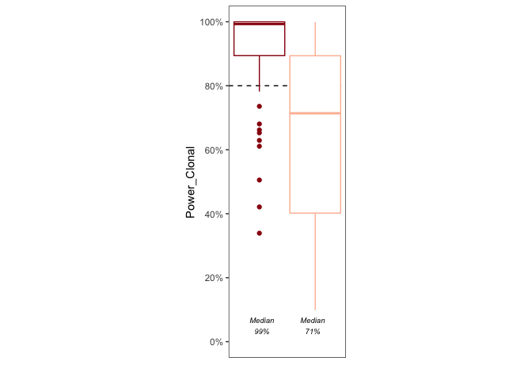
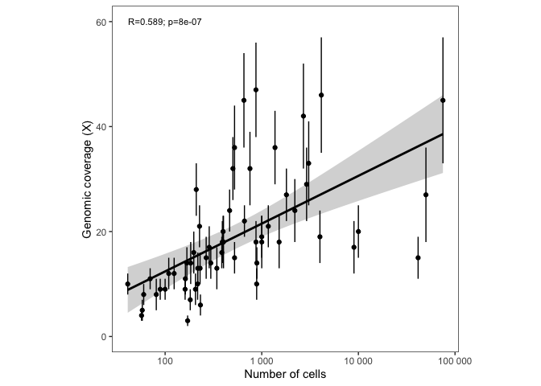

Analyzing initial CTC pairs. Important to distinguish between matched (paired participant = bone marrow AND peripheral blood sample available) and unmatched (unpaired participant = peripheral blood only).

# Data init.


```r
source("0_annotate_samples.R")
dir.create("figures", recursive = TRUE, showWarnings = FALSE)

paired.participants <- paste0("CTF", 
                              c("001", "002", "003", 
                                "012", "013", "015", "016", "017", "018", "019", 
                                "021", "023", "025", 
                                "034", "036", 
                                "046", "047", "048", 
                                "050", "052", "053", "054", "055", "058"))

not.catchthefish <- c("CTF012_BMPCs", "CTF015_BMPCs", "CTF016_BMPCs", "CTF017_BMPCs", "CTF047_BMPCs", "CTF052_BMPCs", "CTF053_BMPCs", "CTF058_BMPCs")
```

# Overview (purity and number of cells)


```r
purity.df <-  clinicaldata |> 
  filter(!is.na(purity) & `entity:sample_id` %nin% not.catchthefish) # these matched marrows have unknown (large) cell count

purity.summary <- purity.df %>%
  group_by(tissue) %>%
  summarise(N=n(), median=median(purity), min=min(purity), max=max(purity), q25=quantile(purity, .25), q72=quantile(purity, .75))

counts.summary <- purity.df %>%
  group_by(tissue) %>%
  summarise(N=n(), median=median(N_cells), min=min(N_cells), max=max(N_cells), q25=quantile(N_cells, .25), q72=quantile(N_cells, .75))

bmpc.purity.label = paste0("N = ", pull(subset(purity.summary, tissue=="BMPCs"), "N"),
                           "\nMedian\n", percent(pull(subset(purity.summary, tissue=="BMPCs"), "median")))

cmmc.purity.label = paste0("N = ", pull(subset(purity.summary, tissue=="CMMCs"), "N"),
                           "\nMedian\n", percent(pull(subset(purity.summary, tissue=="CMMCs"), "median")))

bmpc.count.label <- paste0("N = ", pull(subset(counts.summary, tissue=="BMPCs"), "N"), "\nMedian = ", comma(pull(subset(counts.summary, tissue=="BMPCs"), "median"), accuracy = 100))
cmmc.count.label <- paste0("N = ", pull(subset(counts.summary, tissue=="CMMCs"), "N"), "\nMedian = ", comma(pull(subset(counts.summary, tissue=="CMMCs"), "median"), accuracy = 1))

p1 <- ggplot(purity.df, aes(tissue, purity, color=tissue)) +
  geom_boxplot(fill = NA, outlier.shape = NA) + # don't show outliers twice if already showing real data points
  geom_jitter(width = 0.3, shape=21, alpha=1) +
  scale_y_continuous(limits = c(0, NA), labels = scales::percent) +
  scale_color_manual(values=paired.pals) +
  annotate(geom = "text", x = 0.5, label=bmpc.purity.label, y=0.1, size=2.5, fontface = 'italic', hjust=0) +
  annotate(geom = "text", x = 1.5, label=cmmc.purity.label, y=0.1, size=2.5, fontface = 'italic', hjust=0) +
  labs(x="", y="Tumor purity") +
  theme_bw() +
  theme(panel.grid = element_blank(), legend.position = "none", aspect.ratio = 2) +
  stat_compare_means(label = "p.signif", label.x = 1.5, label.y = 1)
       
p2 <- ggplot(purity.df, aes(tissue, N_cells, color=tissue)) +
  geom_boxplot(fill = NA, outlier.shape = NA) +
  geom_jitter(width = 0.3, shape=21, alpha=1) +
  scale_y_continuous(trans = "pseudo_log", labels=scales::comma, breaks=breaks) +
  annotate(geom = "text", x = 1.1, label=bmpc.count.label, y=50, size=2.5, fontface = 'italic') +
  annotate(geom = "text", x = 2, label=cmmc.count.label, y=20, size=2.5, fontface = 'italic') +
  scale_color_manual(values=paired.pals) +
  scale_fill_manual(values=paired.pals) +
  labs(x="", y="Cells sequenced") +
  theme_bw() +
  theme(panel.grid = element_blank(), legend.position = "none", aspect.ratio = 2) +
  stat_compare_means(label = "p.signif", label.x = 1.5, label.y = 10.5)

p.full <- plot_grid(p2, p1, align = c("hv"))
ggsave(p.full, filename = "figures/purity_counts_boxplot_matched.pdf", height = 3, width = 4)

ggsave(p1, filename = "figures/purity_boxplot_matched.pdf", width = 2, height = 3)
ggsave(p1, filename = "figures/purity_boxplot_matched.png", width = 2, height = 3, dpi = 300)

ggsave(p2, filename = "figures/count_cells_boxplot_matched.pdf", width = 2, height = 3)
ggsave(p2, filename = "figures/count_cells_boxplot_matched.png", width = 2, height = 3, dpi = 300)
```


# Power analysis

Based on MuTect java code on github at broadinstitute/mutect


```r
# power to detect clonal event given purity and so on
power.analysis.data <- clinicaldata %>%
  filter(tissue %in% c("BMPCs", "CMMCs")) %>%
  rowwise() %>%
  mutate(Power_Clonal=calculate_tumor_power(depth = MEDIAN_COVERAGE, 
                          eps=10^-3, tlod=6.3,
                          rho= purity,
                          psi=2,
                          CCF=1),
         Power_Subclonal=calculate_tumor_power(depth = MEDIAN_COVERAGE, 
                          eps=10^-3, tlod=6.3,
                          rho= purity,
                          psi=2,
                          CCF=0.5),
         Power_Subsubclonal=calculate_tumor_power(depth = MEDIAN_COVERAGE, 
                          eps=10^-3, tlod=6.3,
                          rho= purity,
                          psi=2,
                          CCF=0.25))

p.power <- ggplot(power.analysis.data, aes(N_cells)) + 
  geom_point(size=2, shape=21, aes(y=Power_Clonal, color=tissue, fill=tissue)) + 
  geom_smooth(aes(y=Power_Clonal), se = FALSE, color="black", size=.5) +
  geom_point(size=1, shape=2, aes(y=Power_Subclonal, color=tissue), ) + 
  geom_smooth(aes(y=Power_Subclonal), se = FALSE, color="darkgrey", size=.5) +
  scale_x_continuous(breaks=breaks, trans = "pseudo_log") + 
  scale_y_continuous(limits = c(0, 1)) +
  labs(x="Number of cells", y="Detection sensitivity\nClonal and 50% clonal SNVs") +
  scale_color_manual(values=paired.pals) +
  scale_fill_manual(values=paired.pals) +
  theme_bw() +
  theme(panel.grid = element_blank(), aspect.ratio = 1)

print(p.power)
```

<!-- -->

```r
ggsave(p.power, filename="figures/powerfigure-ccf1-0.5.png", width = 4, height = 4)
ggsave(p.power, filename="figures/powerfigure-ccf1-0.5.pdf", width = 4, height = 4)

power.analysis.data.summary.stats <- power.analysis.data %>%
  filter(tissue=="CMMCs") %>%
  ungroup() %>%
  summarise(Median_Power_Clonal=median(Power_Clonal),
            Median_Power_Subclonal=median(Power_Subclonal),
            Q25_Power_Clonal=quantile(Power_Clonal, .25),
            Q75_Power_Clonal=quantile(Power_Clonal, .75),
            Q25_Power_Subclonal=quantile(Power_Subclonal, .25),
            Q75_Power_Subclonal=quantile(Power_Subclonal, .75),
            )

power.analysis.data.summary.stats
```

<div class="kable-table">

<table>
 <thead>
  <tr>
   <th style="text-align:right;"> Median_Power_Clonal </th>
   <th style="text-align:right;"> Median_Power_Subclonal </th>
   <th style="text-align:right;"> Q25_Power_Clonal </th>
   <th style="text-align:right;"> Q75_Power_Clonal </th>
   <th style="text-align:right;"> Q25_Power_Subclonal </th>
   <th style="text-align:right;"> Q75_Power_Subclonal </th>
  </tr>
 </thead>
<tbody>
  <tr>
   <td style="text-align:right;"> 0.9928828 </td>
   <td style="text-align:right;"> 0.7139875 </td>
   <td style="text-align:right;"> 0.8941617 </td>
   <td style="text-align:right;"> 0.9997648 </td>
   <td style="text-align:right;"> 0.4018984 </td>
   <td style="text-align:right;"> 0.8938513 </td>
  </tr>
</tbody>
</table>

</div>

```r
cmmc.power <- power.analysis.data %>%
  filter(tissue=="CMMCs") %>%
  ggplot(aes(1)) +
  geom_hline(yintercept = 0.8, linetype=2) +
  geom_boxplot(aes(y=Power_Clonal), position = position_nudge(x=-0.11), width=0.2, color="#99000D") +
  geom_boxplot(aes(y=Power_Subclonal), position = position_nudge(x=0.11), width=0.2, color="#FCBBA1") +
  annotate(geom = "text", x = 0.9, y=0.05, label=paste0("Median\n", scales::percent(pull(power.analysis.data.summary.stats, Median_Power_Clonal))), size=2.5, fontface = 'italic') +
  annotate(geom = "text", x = 1.1, y=0.05, label=paste0("Median\n", scales::percent(pull(power.analysis.data.summary.stats, Median_Power_Subclonal))), size=2.5, fontface = 'italic') +
  scale_y_continuous(limits = c(0, 1), labels=scales::percent, breaks = c(0, 0.2, 0.4, 0.6, 0.8, 1)) +
  theme_bw() +
  scale_color_manual(values=brewer.pal(8, "Reds")) +
  scale_fill_manual(values=paired.pals) +
  labs(x="") +
  theme(panel.grid = element_blank(), aspect.ratio = 3, axis.ticks.x = element_blank(), axis.text.x = element_blank())

print(cmmc.power)
```

<!-- -->

```r
ggsave(cmmc.power, filename="figures/powerfigure-ccf1-0.5-cmmc_only_boxplot.png", width = 4, height = 4)
ggsave(cmmc.power, filename="figures/powerfigure-ccf1-0.5-cmmc_only_boxplot.pdf", width = 4, height = 4)
```


# WGS coverage


```r
cor.data.wgs.coverage <- clinicaldata %>%
  filter(tissue=="CMMCs") %>%
  mutate(Log_N_Cells=log10(N_cells)) %>%
  summarize(tidy(cor.test(Log_N_Cells, MEDIAN_COVERAGE)))

wgs.coverage.details <- clinicaldata %>%
  filter(tissue=="CMMCs") %>%
  ggplot(aes(N_cells, MEDIAN_COVERAGE)) +
  geom_smooth(method="lm", color="black") +
  annotate(geom="text", label=paste0("R=", signif(pull(cor.data.wgs.coverage, estimate), 3), "; p=", signif(pull(cor.data.wgs.coverage, p.value), 1)), x = 100, y=60, size=3) +
  geom_point() +
  geom_linerange(aes(ymin=MEDIAN_COVERAGE-MAD_COVERAGE, ymax=MEDIAN_COVERAGE+MAD_COVERAGE)) +
  scale_x_continuous(trans = "pseudo_log", limits=c(NA, NA), breaks = breaks, minor_breaks = minor_breaks, labels = scales::number) +
  scale_y_continuous(limits=c(0, NA)) +
  labs(x="Number of cells", y="Genomic coverage (X)") +
  theme_bw() +
  theme(aspect.ratio = 1, panel.grid = element_blank())


print(wgs.coverage.details)
```

```
## `geom_smooth()` using formula 'y ~ x'
```

<!-- -->

```r
ggsave(wgs.coverage.details, filename="figures/wgs_coverage_details.png", width = 4, height = 4)
```

```
## `geom_smooth()` using formula 'y ~ x'
```

```r
ggsave(wgs.coverage.details, filename="figures/wgs_coverage_details.pdf", width = 4, height = 4)
```

```
## `geom_smooth()` using formula 'y ~ x'
```

# Session info


```r
sessionInfo()
```

```
R version 4.1.1 (2021-08-10)
Platform: x86_64-apple-darwin17.0 (64-bit)
Running under: macOS Big Sur 10.16

Matrix products: default
BLAS:   /Library/Frameworks/R.framework/Versions/4.1/Resources/lib/libRblas.0.dylib
LAPACK: /Library/Frameworks/R.framework/Versions/4.1/Resources/lib/libRlapack.dylib

locale:
[1] en_US.UTF-8/en_US.UTF-8/en_US.UTF-8/C/en_US.UTF-8/en_US.UTF-8

attached base packages:
[1] stats     graphics  grDevices utils     datasets  methods   base     

other attached packages:
 [1] colorspace_2.0-2   circlize_0.4.13    scales_1.1.1       ggpubr_0.4.0      
 [5] readxl_1.3.1       cowplot_1.1.1      maftools_2.8.05    RColorBrewer_1.1-2
 [9] kableExtra_1.3.4   rstatix_0.7.0      data.table_1.14.0  forcats_0.5.1     
[13] stringr_1.4.0      dplyr_1.0.7        purrr_0.3.4        readr_2.0.1       
[17] tidyr_1.1.3        tibble_3.1.3       ggplot2_3.3.5      tidyverse_1.3.1   

loaded via a namespace (and not attached):
 [1] nlme_3.1-152        fs_1.5.0            bit64_4.0.5        
 [4] lubridate_1.7.10    webshot_0.5.2       httr_1.4.2         
 [7] tools_4.1.1         backports_1.2.1     bslib_0.2.5.1      
[10] utf8_1.2.2          R6_2.5.0            mgcv_1.8-36        
[13] DBI_1.1.1           withr_2.4.2         tidyselect_1.1.1   
[16] bit_4.0.4           curl_4.3.2          compiler_4.1.1     
[19] cli_3.1.0           rvest_1.0.1         xml2_1.3.2         
[22] labeling_0.4.2      sass_0.4.0          systemfonts_1.0.3  
[25] digest_0.6.27       foreign_0.8-81      rmarkdown_2.10     
[28] svglite_2.0.0       rio_0.5.27          pkgconfig_2.0.3    
[31] htmltools_0.5.1.1   highr_0.9           dbplyr_2.1.1       
[34] rlang_0.4.11        GlobalOptions_0.1.2 rstudioapi_0.13    
[37] farver_2.1.0        shape_1.4.6         jquerylib_0.1.4    
[40] generics_0.1.0      jsonlite_1.7.2      vroom_1.5.4        
[43] zip_2.2.0           car_3.0-11          magrittr_2.0.1     
[46] Matrix_1.3-4        Rcpp_1.0.7          munsell_0.5.0      
[49] fansi_0.5.0         abind_1.4-5         lifecycle_1.0.0    
[52] stringi_1.7.3       yaml_2.2.1          carData_3.0-4      
[55] grid_4.1.1          parallel_4.1.1      crayon_1.4.1       
[58] lattice_0.20-44     haven_2.4.3         splines_4.1.1      
[61] hms_1.1.0           knitr_1.33          pillar_1.6.2       
[64] ggsignif_0.6.2      codetools_0.2-18    reprex_2.0.1       
[67] glue_1.4.2          evaluate_0.14       modelr_0.1.8       
[70] vctrs_0.3.8         tzdb_0.1.2          cellranger_1.1.0   
[73] gtable_0.3.0        assertthat_0.2.1    xfun_0.25          
[76] openxlsx_4.2.4      broom_0.7.9         survival_3.2-12    
[79] viridisLite_0.4.0   ellipsis_0.3.2     
```
