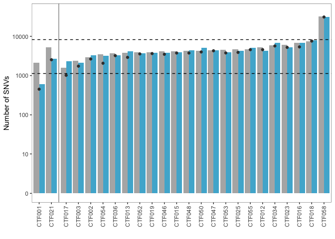

```r
source("0_annotate_samples.R")
dir.create("figures")

paired.participants <- paste0("CTF", 
                              c("001", "002", "003", 
                                "012", "013", "015", "016", "017", "018", "019", 
                                "021", "023", "025", 
                                "034", "036", 
                                "046", "047", "048", 
                                "050", "052", "053", "054", "055", "058"))
```

Contains sample and cohort-level information on variant detection

# SNVs and indels post-process

These two participants with matched BMPCs didn't achieve 80% SNV sensitivity and are in a single facet


```r
last.maf <- read_maf("../data/AllRevisions.txt")
annot.maf <- last.maf %>% inner_join(clinicaldata, by=c("Tumor_Sample_Barcode"))

# overall we're powered to detect mutations at 33% CCF by MuTect calculation
summarize.paired.annot.maf <- annot.maf %>%
  filter(ccf_hat>0.33 & participant %in% paired.participants & isRef==TRUE) %>%
  group_by(participant, tissue) %>%
  summarize(N_mut=n(),
            N_snp=sum(Variant_Type=="SNP", na.rm = TRUE),
            N_clonal=sum(ccf_hat>=0.9, na.rm = TRUE),
            N_subclonal=sum(ccf_hat>=0.1 & ccf_hat<0.9, na.rm = TRUE),
            N_nonsym=sum(Variant_Classification %in% non.synonymous)) %>%
  arrange(tissue) %>%
  mutate(powered=!(participant %in% c("CTF001", "CTF021")))
```

```
## `summarise()` has grouped output by 'participant'. You can override using the `.groups` argument.
```

# Jaccard Index and intersection analysis of mutations between bone marrow and peripheral blood compartments


```r
# estimate mutation intersection
ctc <- annot.maf %>%
  filter(ccf_hat>0 & participant %in% paired.participants & isRef==TRUE & tissue=="CMMCs") %>%
  select(participant, Chromosome, Start_position, End_position, Tumor_Seq_Allele2, Variant_Type, Variant_Classification)
bmpc <- annot.maf %>%
  filter(ccf_hat>0 & participant %in% paired.participants & isRef==TRUE & tissue=="BMPCs") %>%
  select(participant, Chromosome, Start_position, End_position, Tumor_Seq_Allele2, Variant_Type, Variant_Classification)
intersect.tissue.per.participant <- inner_join(ctc, bmpc) %>%
  mutate(tissue="intersection") %>%
  group_by(participant, tissue) %>%
  summarize(N_mut=n(),
            N_snp=sum(Variant_Type=="SNP", na.rm = TRUE),
            N_nonsym=sum(Variant_Classification %in% non.synonymous)) %>%
  mutate(powered=!(participant %in% c("CTF001", "CTF021")))
```

```
## Joining, by = c("participant", "Chromosome", "Start_position", "End_position", "Tumor_Seq_Allele2", "Variant_Type", "Variant_Classification")
```

```
## `summarise()` has grouped output by 'participant'. You can override using the `.groups` argument.
```

```r
union.tissue.per.participant <- full_join(ctc, bmpc) %>%
  mutate(tissue="full_join") %>%
  group_by(participant, tissue) %>%
  summarize(N_mut=n(),
            N_snp=sum(Variant_Type=="SNP", na.rm = TRUE),
            N_nonsym=sum(Variant_Classification %in% non.synonymous)) %>%
  mutate(powered=!(participant %in% c("CTF001", "CTF021")))
```

```
## Joining, by = c("participant", "Chromosome", "Start_position", "End_position", "Tumor_Seq_Allele2", "Variant_Type", "Variant_Classification")
## `summarise()` has grouped output by 'participant'. You can override using the `.groups` argument.
```

```r
jaccard.index <- rbindlist(list(intersect.tissue.per.participant, union.tissue.per.participant), fill=TRUE) %>%
  group_by(participant) %>%
  summarize(jaccard.index = N_mut[tissue=="intersection"]/N_mut[tissue=="full_join"]) %>%
  ungroup() %>%
  summarise(tidy(summary(jaccard.index)))
```

```
## Warning: `tidy.summaryDefault()` is deprecated. Please use `skimr::skim()`
## instead.
```

```r
tibble(jaccard.index)
```

<div class="kable-table">

<table>
 <thead>
  <tr>
   <th style="text-align:right;"> minimum </th>
   <th style="text-align:right;"> q1 </th>
   <th style="text-align:right;"> median </th>
   <th style="text-align:right;"> mean </th>
   <th style="text-align:right;"> q3 </th>
   <th style="text-align:right;"> maximum </th>
  </tr>
 </thead>
<tbody>
  <tr>
   <td style="text-align:right;"> 0.1014169 </td>
   <td style="text-align:right;"> 0.5480849 </td>
   <td style="text-align:right;"> 0.7114985 </td>
   <td style="text-align:right;"> 0.619496 </td>
   <td style="text-align:right;"> 0.7365428 </td>
   <td style="text-align:right;"> 0.8530239 </td>
  </tr>
</tbody>
</table>

</div>

# Show mutants


```r
snv.matched.comp <- ggplot(summarize.paired.annot.maf, aes(x=fct_reorder(participant, N_mut, first), xend=fct_reorder(participant, N_mut, first), y=N_mut, fill=tissue)) +
  geom_bar(stat='identity', position = 'dodge') +
  geom_point(data=intersect.tissue.per.participant, aes(y=N_mut), color="#3B3B3B") +
  geom_hline(yintercept = c(1130, 8244), linetype=2) + # range from Oben et al
  scale_y_continuous(breaks = c(0, 10, 100, 1e3, 1e4), limits=c(0, 4*1e4), trans = "pseudo_log") +
  facet_grid(~powered, scales="free_x", space = "free_x") +
  scale_fill_manual(values=c(paired.pals, "intersection"="green")) +
  labs(x="", y="Number of SNVs") +
  theme_bw() +
  theme(panel.grid = element_blank(),
        legend.position = "none",
        axis.text.x = element_text(angle = 90, vjust = 0.5),
        strip.background = element_blank(),
        strip.text = element_blank(),
        panel.spacing.y = unit(0.3, "lines"),
        panel.spacing.x = unit(0, "lines"),
        panel.border = element_rect(size=.3, fill = NA))

print(snv.matched.comp)
```

<!-- -->

```r
ggsave("figures/snv.matched.comp.rev.png", snv.matched.comp, width = 4, height = 4)
ggsave("figures/snv.matched.comp.rev.pdf", snv.matched.comp, width = 4, height = 4)
```


# Session info


```r
sessionInfo()
```

```
R version 4.1.1 (2021-08-10)
Platform: x86_64-apple-darwin17.0 (64-bit)
Running under: macOS Big Sur 10.16

Matrix products: default
BLAS:   /Library/Frameworks/R.framework/Versions/4.1/Resources/lib/libRblas.0.dylib
LAPACK: /Library/Frameworks/R.framework/Versions/4.1/Resources/lib/libRlapack.dylib

locale:
[1] en_US.UTF-8/en_US.UTF-8/en_US.UTF-8/C/en_US.UTF-8/en_US.UTF-8

attached base packages:
[1] stats     graphics  grDevices utils     datasets  methods   base     

other attached packages:
 [1] colorspace_2.0-2   circlize_0.4.13    scales_1.1.1       ggpubr_0.4.0      
 [5] readxl_1.3.1       cowplot_1.1.1      maftools_2.8.05    RColorBrewer_1.1-2
 [9] kableExtra_1.3.4   rstatix_0.7.0      data.table_1.14.0  forcats_0.5.1     
[13] stringr_1.4.0      dplyr_1.0.7        purrr_0.3.4        readr_2.0.1       
[17] tidyr_1.1.3        tibble_3.1.3       ggplot2_3.3.5      tidyverse_1.3.1   

loaded via a namespace (and not attached):
 [1] fs_1.5.0            bit64_4.0.5         lubridate_1.7.10   
 [4] webshot_0.5.2       httr_1.4.2          tools_4.1.1        
 [7] backports_1.2.1     bslib_0.2.5.1       utf8_1.2.2         
[10] R6_2.5.0            DBI_1.1.1           withr_2.4.2        
[13] tidyselect_1.1.1    bit_4.0.4           curl_4.3.2         
[16] compiler_4.1.1      cli_3.1.0           rvest_1.0.1        
[19] xml2_1.3.2          sass_0.4.0          systemfonts_1.0.3  
[22] digest_0.6.27       foreign_0.8-81      rmarkdown_2.10     
[25] svglite_2.0.0       rio_0.5.27          pkgconfig_2.0.3    
[28] htmltools_0.5.1.1   highr_0.9           dbplyr_2.1.1       
[31] rlang_0.4.11        GlobalOptions_0.1.2 rstudioapi_0.13    
[34] farver_2.1.0        shape_1.4.6         jquerylib_0.1.4    
[37] generics_0.1.0      jsonlite_1.7.2      vroom_1.5.4        
[40] zip_2.2.0           car_3.0-11          magrittr_2.0.1     
[43] Matrix_1.3-4        Rcpp_1.0.7          munsell_0.5.0      
[46] fansi_0.5.0         abind_1.4-5         lifecycle_1.0.0    
[49] stringi_1.7.3       yaml_2.2.1          carData_3.0-4      
[52] grid_4.1.1          parallel_4.1.1      crayon_1.4.1       
[55] lattice_0.20-44     haven_2.4.3         splines_4.1.1      
[58] hms_1.1.0           knitr_1.33          pillar_1.6.2       
[61] ggsignif_0.6.2      reprex_2.0.1        glue_1.4.2         
[64] evaluate_0.14       modelr_0.1.8        vctrs_0.3.8        
[67] tzdb_0.1.2          cellranger_1.1.0    gtable_0.3.0       
[70] assertthat_0.2.1    xfun_0.25           openxlsx_4.2.4     
[73] broom_0.7.9         survival_3.2-12     viridisLite_0.4.0  
[76] ellipsis_0.3.2     
```
