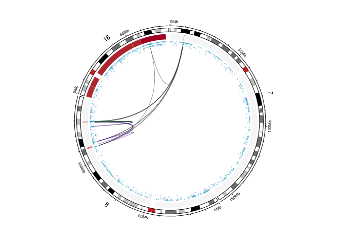
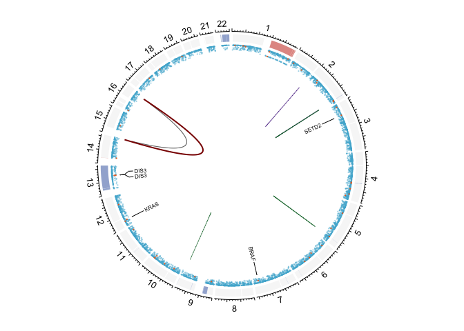
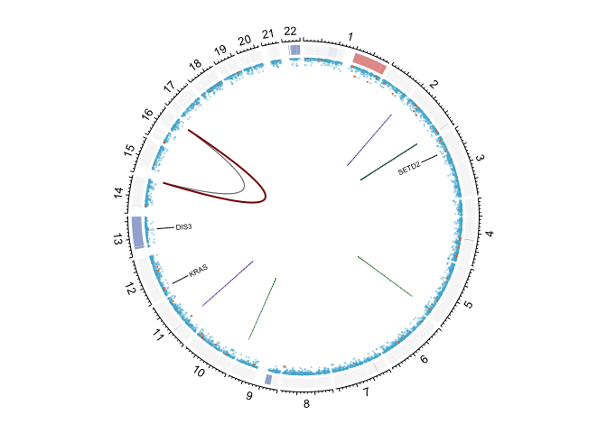

# Init session

When running this code from console, `setwd` to `2_wgs`.


```r
source("0_annotate_samples.R")
source("../0_utils/circos_utils.R")

dir.create("figures")

CNV.df <- read_tsv("data/Sept9_reprocessed.cnv.revisions3.seg") # copy number can be public
maf <- read_maf("../data/20221017_AllPairsAndAD_maf_ac_pp_ccf_fit_v3.maf") # mutations are too specific for public-access. needs dbGAP level
# SVs are split into IGH/MYC specific calls and genome-wide calls.
ctf.tx <- read_tsv("../data/CTF.whitelist.oct17.txt")
svs <- read_xlsx("../data/CMMCs_ConsensusSV_filtered_results_whitelist_Oct17.xlsx") 

contigs <- factor(1:22, levels=c(1:22))
sectors <- paste0("chr", contigs) # circlize uses UCSC chr notation.
```

# Post-process CNVs

`YMIN`/`YMAX` will set the offset for graphical representation 


```r
contigs <- factor(1:22, levels=c(1:22))

CNV.df <- CNV.df %>% 
  inner_join(clinicaldata, by=c("entity:sample_id")) %>% 
  filter(Chromosome %in% contigs) %>%
  mutate(Chromosome=factor(Chromosome, levels=contigs),
         Norm_Segment_Mean = pmax(0, pmin(Segment_Mean, 4)),
         YMIN=ifelse(tissue=="BMPCs", 0, 1), 
         YMAX =ifelse(tissue=="BMPCs", 1, 2))
```

# Post-process SNV and indels

WGS pipeline adds a `_tumor` to `pair_id` that we need to get rid of.


```r
maf <- maf |>
  mutate(sample_id=str_remove(Tumor_Sample_Barcode, "_tumor")) |>
  left_join(clinicaldata, by=c("sample_id"="entity:sample_id"))
```

# Post-process SVs

For manual review of IGH/MYC specific SVs and REBC-like SVs.


```r
ctf.tx <- ctf.tx %>% 
  filter(Keep=="TRUE") %>%
  left_join(clinicaldata, by=c("ID"="entity:sample_id")) %>%
  relocate(CHR.IG, IG_START, CHR.ONCO, PARTNER_START) %>% 
  mutate(chr1 = paste0("chr", CHR.IG), 
         chr2 = paste0("chr", CHR.ONCO),
         start1 = IG_START,
         end1 = IG_START,
         start2 = PARTNER_START,
         end2 = PARTNER_START) %>%
  mutate(chr1 = case_when(chr1=="chr23" ~ "ChrX",
                          chr1=="chr24" ~ "ChrY",
                          TRUE ~ chr1)) %>%
    group_by(ID, IG, ONCO) %>%
    slice_head(n=1) %>%
    filter(chr1 %in% sectors & chr2 %in% sectors)
svs <- svs %>% filter(keep==1) %>% left_join(clinicaldata, by=c("individual"="entity:sample_id"))
```


# Re-format all for circlize

## CTF025 and CTF031 examples


```r
p.id="CTF025_CMMCs_198"

plot.single.circos(p.id = p.id, sectors = sectors, ctf = ctf.tx, cn=CNV.df, svs=svs, maf=maf, non.synonymous = non.synonymous, genes.of.interest = genes.of.interest, filename = "figures/" %+% p.id)
plot.single.circos(p.id = p.id, sectors = sectors, ctf = ctf.tx, cn=CNV.df, svs=svs, maf=maf, non.synonymous = non.synonymous, genes.of.interest = genes.of.interest)
```

<!-- -->


```r
p.id="CTF031_CMMCs_41500"

plot.single.circos(p.id = p.id, sectors = sectors, ctf = ctf.tx, cn=CNV.df, svs=svs, maf=maf, non.synonymous = non.synonymous, genes.of.interest = genes.of.interest, filename = "figures/" %+% p.id)
plot.single.circos(p.id = p.id, sectors = sectors, ctf = ctf.tx, cn=CNV.df, svs=svs, maf=maf, non.synonymous = non.synonymous, genes.of.interest = genes.of.interest)
```

<!-- -->

## Chromothripsis of chr 3 in CTF033


```r
p.id="CTF033_CMMCs_755"

p1 <- plot.single.circos(p.id = p.id, sectors = sectors, ctf = ctf.tx, cn=CNV.df, svs=svs, maf=maf, non.synonymous = non.synonymous, genes.of.interest = genes.of.interest)
```

<!-- -->

```r
p2 <- plot.single.circos(p.id = p.id, sectors = "chr3", ctf = ctf.tx, cn=CNV.df, svs=svs, maf=maf, non.synonymous = non.synonymous, genes.of.interest = genes.of.interest, axis.labels.cex = .5, plotType = c('axis', 'ideogram', 'labels'))
```

<!-- -->

```r
plot_grid(p1, p2)
```

<!-- -->

```r
plot.single.circos(p.id = p.id, sectors = sectors, ctf = ctf.tx, cn=CNV.df, svs=svs, maf=maf, non.synonymous = non.synonymous, genes.of.interest = genes.of.interest, filename = "figures/" %+% p.id %+% ".pdf")
```

```
## quartz_off_screen 
##                 2
```

```r
plot.single.circos(p.id = p.id, sectors = "chr3", ctf = ctf.tx, cn=CNV.df, svs=svs, maf=maf, non.synonymous = non.synonymous, genes.of.interest = genes.of.interest, filename = "figures/" %+% p.id %+% "_zoom.pdf", axis.labels.cex = .5, plotType = c('axis', 'ideogram', 'labels'))
```

```
## quartz_off_screen 
##                 2
```

## Chromoplexy of chr 7, 8, 18 in CTF034

### In CMMCs:


```r
p.id="CTF034_CMMCs_654"
sectors.ctf034 <- "chr" %+% c(7, 8, 18)

plot.single.circos(p.id = p.id, sectors = sectors.ctf034, ctf = ctf.tx, cn=CNV.df, svs=svs, maf=maf, non.synonymous = non.synonymous, genes.of.interest = genes.of.interest, axis.labels.cex = .5, plotType = c('axis', 'ideogram', 'labels'))
```

<!-- -->

```r
plot.single.circos(p.id = p.id, sectors = sectors.ctf034, ctf = ctf.tx, cn=CNV.df, svs=svs, maf=maf, non.synonymous = non.synonymous, genes.of.interest = genes.of.interest, axis.labels.cex = .5, plotType = c('axis', 'ideogram', 'labels'), filename = "figures/" %+% p.id %+% "_zoom.pdf")
```

```
## quartz_off_screen 
##                 2
```

### In BMPCs:


```r
p.id="CTF034_BMPCs_16800"
sectors.ctf034 <- "chr" %+% c(7, 8, 18)

plot.single.circos(p.id = p.id, sectors = sectors.ctf034, ctf = ctf.tx, cn=CNV.df, svs=svs, maf=maf, non.synonymous = non.synonymous, genes.of.interest = genes.of.interest, axis.labels.cex = .5, plotType = c('axis', 'ideogram', 'labels'))
```

<!-- -->

```r
plot.single.circos(p.id = p.id, sectors = sectors.ctf034, ctf = ctf.tx, cn=CNV.df, svs=svs, maf=maf, non.synonymous = non.synonymous, genes.of.interest = genes.of.interest, axis.labels.cex = .5, plotType = c('axis', 'ideogram', 'labels'), filename = "figures/" %+% p.id %+% "_zoom.pdf")
```

```
## quartz_off_screen 
##                 2
```


## CTF047 example


```r
p.id="CTF047_BMPCs"

plot.single.circos(p.id = p.id, sectors = sectors, ctf = ctf.tx, cn=CNV.df, svs=svs, maf=maf, non.synonymous = non.synonymous, genes.of.interest = genes.of.interest, filename = "figures/CTF047_PBMCs.pdf")
```

```
## quartz_off_screen 
##                 2
```

```r
plot.single.circos(p.id = p.id, sectors = sectors, ctf = ctf.tx, cn=CNV.df, svs=svs, maf=maf, non.synonymous = non.synonymous, genes.of.interest = genes.of.interest)
```

<!-- -->

```r
p.id="CTF047_CMMCs_75k"

plot.single.circos(p.id = p.id, sectors = sectors, ctf = ctf.tx, cn=CNV.df, svs=svs, maf=maf, non.synonymous = non.synonymous, genes.of.interest = genes.of.interest, filename = "figures/" %+% p.id %+% ".pdf")
```

```
## quartz_off_screen 
##                 2
```

```r
plot.single.circos(p.id = p.id, sectors = sectors, ctf = ctf.tx, cn=CNV.df, svs=svs, maf=maf, non.synonymous = non.synonymous, genes.of.interest = genes.of.interest)
```

<!-- -->

## CTF032 over time


```r
p.id="CTF032_CMMCs_9k"

plot.single.circos(p.id = p.id, sectors = sectors, ctf = ctf.tx, cn=CNV.df, svs=svs, maf=maf, non.synonymous = non.synonymous, genes.of.interest = genes.of.interest, filename = "figures/" %+% p.id %+% ".pdf")
```

```
## quartz_off_screen 
##                 2
```

```r
plot.single.circos(p.id = p.id, sectors = sectors, ctf = ctf.tx, cn=CNV.df, svs=svs, maf=maf, non.synonymous = non.synonymous, genes.of.interest = genes.of.interest)
```

<!-- -->

```r
p.id="CTF032_CMMCs_T1_2200"

plot.single.circos(p.id = p.id, sectors = sectors, ctf = ctf.tx, cn=CNV.df, svs=svs, maf=maf, non.synonymous = non.synonymous, genes.of.interest = genes.of.interest, filename = "figures/" %+% p.id %+% ".pdf")
```

```
## quartz_off_screen 
##                 2
```

```r
plot.single.circos(p.id = p.id, sectors = sectors, ctf = ctf.tx, cn=CNV.df, svs=svs, maf=maf, non.synonymous = non.synonymous, genes.of.interest = genes.of.interest)
```

<!-- -->

# Session info


```r
sessionInfo()
```

```
R version 4.1.1 (2021-08-10)
Platform: x86_64-apple-darwin17.0 (64-bit)
Running under: macOS Big Sur 10.16

Matrix products: default
BLAS:   /Library/Frameworks/R.framework/Versions/4.1/Resources/lib/libRblas.0.dylib
LAPACK: /Library/Frameworks/R.framework/Versions/4.1/Resources/lib/libRlapack.dylib

locale:
[1] en_US.UTF-8/en_US.UTF-8/en_US.UTF-8/C/en_US.UTF-8/en_US.UTF-8

attached base packages:
[1] stats     graphics  grDevices utils     datasets  methods   base     

other attached packages:
 [1] colorspace_2.0-2   circlize_0.4.13    scales_1.1.1       ggpubr_0.4.0      
 [5] readxl_1.3.1       cowplot_1.1.1      maftools_2.8.05    RColorBrewer_1.1-2
 [9] kableExtra_1.3.4   rstatix_0.7.0      data.table_1.14.0  forcats_0.5.1     
[13] stringr_1.4.0      dplyr_1.0.7        purrr_0.3.4        readr_2.0.1       
[17] tidyr_1.1.3        tibble_3.1.3       ggplot2_3.3.5      tidyverse_1.3.1   

loaded via a namespace (and not attached):
 [1] fs_1.5.0            bit64_4.0.5         lubridate_1.7.10   
 [4] webshot_0.5.2       httr_1.4.2          tools_4.1.1        
 [7] backports_1.2.1     bslib_0.2.5.1       utf8_1.2.2         
[10] R6_2.5.0            DBI_1.1.1           withr_2.4.2        
[13] tidyselect_1.1.1    bit_4.0.4           curl_4.3.2         
[16] compiler_4.1.1      cli_3.1.0           rvest_1.0.1        
[19] xml2_1.3.2          sass_0.4.0          systemfonts_1.0.3  
[22] digest_0.6.27       foreign_0.8-81      rmarkdown_2.10     
[25] svglite_2.0.0       rio_0.5.27          pkgconfig_2.0.3    
[28] htmltools_0.5.1.1   highr_0.9           dbplyr_2.1.1       
[31] rlang_0.4.11        GlobalOptions_0.1.2 rstudioapi_0.13    
[34] shape_1.4.6         jquerylib_0.1.4     generics_0.1.0     
[37] jsonlite_1.7.2      vroom_1.5.4         zip_2.2.0          
[40] car_3.0-11          magrittr_2.0.1      Matrix_1.3-4       
[43] Rcpp_1.0.7          munsell_0.5.0       fansi_0.5.0        
[46] abind_1.4-5         lifecycle_1.0.0     stringi_1.7.3      
[49] yaml_2.2.1          carData_3.0-4       grid_4.1.1         
[52] parallel_4.1.1      crayon_1.4.1        lattice_0.20-44    
[55] haven_2.4.3         splines_4.1.1       hms_1.1.0          
[58] knitr_1.33          pillar_1.6.2        ggsignif_0.6.2     
[61] reprex_2.0.1        glue_1.4.2          evaluate_0.14      
[64] modelr_0.1.8        vctrs_0.3.8         tzdb_0.1.2         
[67] cellranger_1.1.0    gtable_0.3.0        assertthat_0.2.1   
[70] xfun_0.25           openxlsx_4.2.4      broom_0.7.9        
[73] survival_3.2-12     viridisLite_0.4.0   ellipsis_0.3.2     
```
