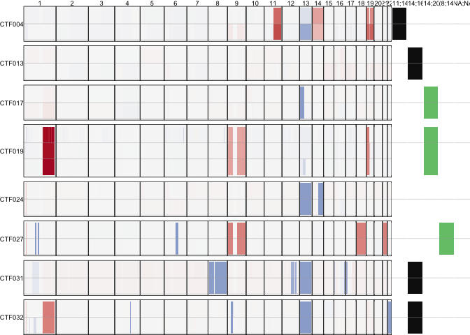

Storing initial CNV heatmap and serial tx data here

# Initial parameters


```r
source("0_annotate_samples.R")
dir.create("figures")

longitudinal.participants <- c("CTF004", "CTF013", "CTF017", "CTF019", "CTF024", "CTF027", 
"CTF031", "CTF032")

# CTF004 was annotated CTF014 in the samplesheet. It is CTF004 longitudinal sampling untreated.
clinicaldata[clinicaldata$`entity:sample_id`=="CTF014_CMMCs_465", "participant"] <- "CTF004"
clinicaldata$Patient_Timepoint <- paste0(clinicaldata$participant, "_", clinicaldata$Timepoint)

CNV.df <- read_tsv("data/Sept9_reprocessed.cnv.revisions3.seg") %>% 
  inner_join(clinicaldata, by=c("entity:sample_id")) %>% 
  filter(participant %in% longitudinal.participants)

ctf.tx <- read_tsv("../data/FullPaper2022.aggregated.ctf.whitelist.feb28.txt") %>% 
  filter(Keep==TRUE) %>%
  right_join(clinicaldata, by=c("ID"="entity:sample_id")) %>%
  filter(tissue=="CMMCs" & participant %in% longitudinal.participants)

contigs <- 1:22

catch.the.fish.pal <- c('TRUE'="#111111", 'FALSE'="#74C476", 'NA'="#FFFFFF")
```

# post-process CNV matrix

Here the trick is to split each row into BMPC and CMMC categories so that facet / panels are kept for chr and participants


```r
CNV.df <- CNV.df %>% 
  filter(Chromosome %in% contigs) %>%
  mutate(Chromosome=factor(Chromosome, levels=contigs),
         Norm_Segment_Mean = pmax(0, pmin(Segment_Mean, 4)),
         YMIN=as.numeric(str_extract(Timepoint, "[012]")),
         YMAX=as.numeric(str_extract(Timepoint, "[012]"))+1) %>%
  relocate(Chromosome, Start, End, Norm_Segment_Mean)
```

# CNV


```r
fig.cnv <- ggplot(CNV.df, 
                  aes(xmin = Start, xmax = End, ymin = YMIN, ymax = YMAX)) +
  geom_rect(aes(fill = Norm_Segment_Mean), colour = NA, size=0) +
  geom_hline(yintercept = c(1,2), size=0.3, color="darkgrey", alpha=0.5) +
  scale_y_reverse() +
  scale_fill_gradient2(low = "#2166AC", high = "#B2182B", mid = "#F7F7F7", midpoint = 2, na.value = "#F7F7F7") +
  labs(fill = "Copy number") +
  facet_grid(rows = vars(participant),
             cols = vars(Chromosome),
             scales = "free", 
             space = "free",
             switch = "y") +
  theme_nothing() +
  theme(
    axis.text.x = element_blank(),
    axis.text.y = element_blank(),
    axis.ticks = element_blank(),
    axis.title = element_blank(),
    panel.background = element_rect(fill="#F7F7F7"),
    panel.spacing.y = unit(0.3, "lines"),
    panel.spacing.x = unit(0, "lines"),
    panel.border = element_rect(size=.3, fill = NA),
    strip.text.y.left = element_text(angle = 0, size = 7),
    strip.text.x.top = element_text(angle = 0, size = 7))
```

# post-process SV results

False positive filtered out


```r
re.con.pts <- ctf.tx %>% 
  filter(Keep=="TRUE" | is.na(Keep)) %>%
  filter(condition=="tumour") %>%
  mutate(TX=paste0("t(", pmin(CHR.ONCO, CHR.IG), ";", pmax(CHR.ONCO, CHR.IG), ")"),
         sample_short=paste0(participant, " ", tissue),
         YMIN=as.numeric(str_extract(Timepoint, "[012]")),
         YMAX=as.numeric(str_extract(Timepoint, "[012]"))+1)
```

# SV plot


```r
sv.plot <- ggplot(re.con.pts, aes(
  xmin = 0,
  xmax = 1e6,
  ymin = YMIN,
  ymax = YMAX
)) +
  geom_rect(aes(fill=FoundbyFISH), colour = NA, size=0) +
  # scale_fill_gradient2(low = "blue", high = "red", mid = "white", midpoint = 0, na.value = "lightgrey") +
  # labs(fill = "L2R") +
  geom_hline(yintercept = 1, size=0.3, color="darkgrey", alpha=0.5) +
  facet_grid(rows = vars(participant),
             cols = vars(TX),
             scales = "free",
             space = "free",
             switch = "y") +
  scale_y_reverse()+
  scale_fill_manual(values=catch.the.fish.pal, na.value = "white") +
  theme_nothing() + 
  theme(
    axis.text.x = element_blank(),
    axis.text.y = element_blank(),
    axis.ticks = element_blank(),
    axis.title = element_blank(),
    panel.spacing.y = unit(0.3, "lines"),
    panel.spacing.x = unit(0, "lines"),
    panel.border = element_rect(size=.3, fill = NA, color=NA),
    strip.text.y.left = element_blank(),
    strip.text.x.top = element_text(size=7))
```

# Combine SV and CNV heatmap


```r
full.plot <- plot_grid(fig.cnv, sv.plot, rel_widths = c(5,1), align = "hv")
```

```
## Warning: Graphs cannot be vertically aligned unless the axis parameter is set.
## Placing graphs unaligned.
```

```r
print(full.plot)
```

<!-- -->

```r
ggsave(full.plot, filename = "figures/fig7-cnv-ig.png", width = 7, height = 3)
ggsave(full.plot, filename = "figures/fig7-cnv-ig.pdf", width = 7, height = 3)
```


# Session info


```r
sessionInfo()
```

```
R version 4.1.1 (2021-08-10)
Platform: x86_64-apple-darwin17.0 (64-bit)
Running under: macOS Big Sur 10.16

Matrix products: default
BLAS:   /Library/Frameworks/R.framework/Versions/4.1/Resources/lib/libRblas.0.dylib
LAPACK: /Library/Frameworks/R.framework/Versions/4.1/Resources/lib/libRlapack.dylib

locale:
[1] en_US.UTF-8/en_US.UTF-8/en_US.UTF-8/C/en_US.UTF-8/en_US.UTF-8

attached base packages:
[1] stats     graphics  grDevices utils     datasets  methods   base     

other attached packages:
 [1] colorspace_2.0-2   circlize_0.4.13    scales_1.1.1       ggpubr_0.4.0      
 [5] readxl_1.3.1       cowplot_1.1.1      maftools_2.8.05    RColorBrewer_1.1-2
 [9] kableExtra_1.3.4   rstatix_0.7.0      data.table_1.14.0  forcats_0.5.1     
[13] stringr_1.4.0      dplyr_1.0.7        purrr_0.3.4        readr_2.0.1       
[17] tidyr_1.1.3        tibble_3.1.3       ggplot2_3.3.5      tidyverse_1.3.1   

loaded via a namespace (and not attached):
 [1] fs_1.5.0            bit64_4.0.5         lubridate_1.7.10   
 [4] webshot_0.5.2       httr_1.4.2          tools_4.1.1        
 [7] backports_1.2.1     bslib_0.2.5.1       utf8_1.2.2         
[10] R6_2.5.0            DBI_1.1.1           withr_2.4.2        
[13] tidyselect_1.1.1    bit_4.0.4           curl_4.3.2         
[16] compiler_4.1.1      cli_3.1.0           rvest_1.0.1        
[19] xml2_1.3.2          labeling_0.4.2      sass_0.4.0         
[22] systemfonts_1.0.3   digest_0.6.27       foreign_0.8-81     
[25] rmarkdown_2.10      svglite_2.0.0       rio_0.5.27         
[28] pkgconfig_2.0.3     htmltools_0.5.1.1   highr_0.9          
[31] dbplyr_2.1.1        rlang_0.4.11        GlobalOptions_0.1.2
[34] rstudioapi_0.13     farver_2.1.0        shape_1.4.6        
[37] jquerylib_0.1.4     generics_0.1.0      jsonlite_1.7.2     
[40] vroom_1.5.4         zip_2.2.0           car_3.0-11         
[43] magrittr_2.0.1      Matrix_1.3-4        Rcpp_1.0.7         
[46] munsell_0.5.0       fansi_0.5.0         abind_1.4-5        
[49] lifecycle_1.0.0     stringi_1.7.3       yaml_2.2.1         
[52] carData_3.0-4       grid_4.1.1          parallel_4.1.1     
[55] crayon_1.4.1        lattice_0.20-44     haven_2.4.3        
[58] splines_4.1.1       hms_1.1.0           knitr_1.33         
[61] pillar_1.6.2        ggsignif_0.6.2      reprex_2.0.1       
[64] glue_1.4.2          evaluate_0.14       modelr_0.1.8       
[67] vctrs_0.3.8         tzdb_0.1.2          cellranger_1.1.0   
[70] gtable_0.3.0        assertthat_0.2.1    xfun_0.25          
[73] openxlsx_4.2.4      broom_0.7.9         survival_3.2-12    
[76] viridisLite_0.4.0   ellipsis_0.3.2     
```
