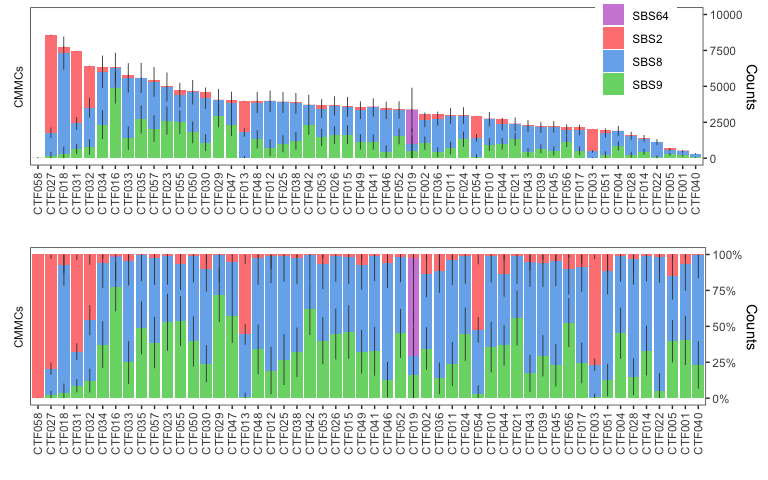
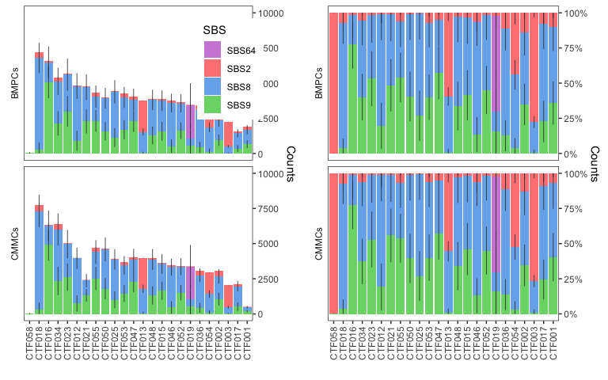

# Aggregating different runs from signature analyzer

ARD-NMF doesn't seem to have a confidence interval estimate.
Luckily, our runs have similar SBS-projected solutions, so we will leverage this to estimate standard deviation around the mean.


```r
library(rhdf5)
library(rsample) # for bootstrapping X

setwd("~/Dropbox (Partners HealthCare)/Projects/ms-cmmcs/3_signature_analyzer/")

source("../2_wgs/0_annotate_samples.R")
source("../0_utils/signature_analyzer_utils.R")

set.seed(414) # because of bootstrapping

cosine <- function(x, y) x %*% y / sqrt(x%*%x * y%*%y)

sbs.pal <- c("SBS64"="#D08BDB", "SBS2"="#FF8485", "SBS8"="#78B1EC", "SBS9"="#79D776")

dir.create("figures")

NRUN=100

paired.participants <- paste0("CTF", 
                              c("001", "002", "003", 
                                "012", "013", "015", "016", "017", "018", "019", 
                                "021", "023", "025", 
                                "034", "036", 
                                "046", "047", "048", 
                                "050", "052", "053", "054", "055", "058"))
```

## Load and summarize X=HW decomposition


```r
h5_object <- "../data/AllRevisions_ccf_powered_no_monomers/nmf_output.h5"

# extract H matrix (signature loading in samples)
signatures <- 0:(NRUN-1) %>%
  map(load_Hmat_SA_h5, h5_object=h5_object) %>%
  bind_rows(.id = "RUN")

summarize.sig.weight <- signatures %>%
  group_by(RUN) %>%
  filter(length(unique(Signature))==4) %>% # 78 out of 100. When increasing NRUN new solutions appear but we use the best as reference
  mutate(SBS=str_extract(Signature, "SBS[0-9]+"), SBS_Number=str_remove(SBS, "SBS")) %>%
  group_by(Tumor_Sample_Barcodes, RUN) %>%
  mutate(SumWeight = sum(Weight)) %>%
  group_by(SBS, SBS_Number, Tumor_Sample_Barcodes) %>%
  summarize(sum=sum(Weight), mean=mean(Weight), sd=sd(Weight), 
            ci_low=mean-2*sd, ci_high=mean+2*sd, 
            sd_low=mean-sd, sd_high=mean+sd,
            frac_mean=mean(Weight/SumWeight), frac_sd=sd(Weight/SumWeight)) %>%
  arrange(rev(SBS)) %>%
  group_by(Tumor_Sample_Barcodes) %>%
  mutate(cummean=cumsum(mean), 
         cum_cilow=pmax(0, cummean-2*sd), cum_cihigh=cummean+2*sd, 
         cum_sdlow=pmax(0, cummean-sd), cum_sdhigh=cummean+sd) %>%
  mutate(fraccummean=cumsum(frac_mean), 
         fraccum_cilow=pmax(0, fraccummean-2*frac_sd), 
         fraccum_sdlow=pmax(0, fraccummean-frac_sd), 
         fraccum_cihigh=pmin(1, fraccummean+2*frac_sd),
         fraccum_sdhigh=pmin(1, fraccummean+frac_sd))
```

```
## `summarise()` has grouped output by 'SBS', 'SBS_Number'. You can override using the `.groups` argument.
```

```r
summarize.sig.weight <- signatures %>%
  mutate(SBS=str_extract(Signature, "SBS[0-9]+")) %>%
  group_by(SBS) %>%
  filter(length(unique(RUN)) > 2) %>%
  group_by(RUN, SBS, Tumor_Sample_Barcodes) %>%
  summarise(Weight=sum(Weight, na.rm = TRUE)) %>% # is several signatures match the same SBS
  ungroup() %>%
  complete(Tumor_Sample_Barcodes, RUN, SBS, fill=list(Weight=0)) %>% # does nt work
  mutate(SBS_Number=str_remove(SBS, "SBS")) %>%
  group_by(Tumor_Sample_Barcodes, RUN) %>%
  mutate(SumWeight = sum(Weight)) %>%
  group_by(SBS, SBS_Number, Tumor_Sample_Barcodes) %>%
  summarize(sum=sum(Weight), mean=mean(Weight), sd=sd(Weight), 
            ci_low=mean-2*sd, ci_high=mean+2*sd, 
            sd_low=mean-sd, sd_high=mean+sd,
            frac_mean=mean(Weight/SumWeight), frac_sd=sd(Weight/SumWeight)) %>%
  mutate(SBS=factor(SBS, levels=paste0("SBS", unique(sort(SBS_Number))))) %>%
  arrange(rev(SBS)) %>%
  group_by(Tumor_Sample_Barcodes) %>%
  mutate(cummean=cumsum(mean), 
         cum_cilow=pmax(0, cummean-2*sd), cum_cihigh=cummean+2*sd, 
         cum_sdlow=pmax(0, cummean-sd), cum_sdhigh=cummean+sd) %>%
  mutate(fraccummean=cumsum(frac_mean), 
         fraccum_cilow=pmax(0, fraccummean-2*frac_sd), 
         fraccum_sdlow=pmax(0, fraccummean-frac_sd), 
         fraccum_cihigh=pmin(1, fraccummean+2*frac_sd),
         fraccum_sdhigh=pmin(1, fraccummean+frac_sd))
```

```
## `summarise()` has grouped output by 'RUN', 'SBS'. You can override using the `.groups` argument.
## `summarise()` has grouped output by 'SBS', 'SBS_Number'. You can override using the `.groups` argument.
```

```r
summarize.sig.weight.annot <- summarize.sig.weight %>% 
  inner_join(clinicaldata, by=c("Tumor_Sample_Barcodes"="Tumor_Sample_Barcode")) %>%
  filter(tissue=="CMMCs" & isRef==TRUE)
```

## fraction of APOBEC


```r
# in our case they are in the same component with pcawg_Composante but we sum SBS2 and SBS13 weights when they appear separately
# also see CTF014 is timepoint T1 of CTF004 (modified in other files but not in raw MAF)

summarize.sig.weight.annot %>%
  filter(SBS%in%c("SBS2", "SBS13") & participant != "CTF014" & tissue=="CMMCs") %>%
  ggplot(aes(fct_reorder(participant, frac_mean), frac_mean)) +
  geom_hline(yintercept = 0.11) +
  geom_bar(stat="identity") +
  theme_bw() +
  theme(panel.grid = element_blank(),
        axis.text.x = element_text(angle=90))
```

<!-- -->

## Visualize output


```r
dir.create("figures", showWarnings = FALSE)

# p0 <- ggplot(summarize.sig.weight.annot, aes(fct_reorder(factor(participant), cummean, max, .desc = TRUE), mean, fill=SBS)) + 
#   geom_bar(stat="identity") + 
#   geom_linerange(aes(ymin=cum_sdlow, ymax=cum_sdhigh), color="#3B3B3B", size=0.3) +
#   facet_grid(rows = "tissue", switch = "y") +
#   scale_fill_manual(values=sbs.pal) +
#   scale_y_continuous(position = "right") +
#   labs(x="", y="Counts") +
#   theme_bw() +
#   theme(panel.grid = element_blank(), strip.background = element_blank(), axis.text.x = element_text(angle = 90, vjust=.5), legend.position = c(0.9, 0.8))
p1 <- ggplot(summarize.sig.weight.annot, aes(fct_reorder(factor(participant), cummean, max, .desc = TRUE), mean, fill=SBS)) + 
  geom_bar(stat="identity") + 
  geom_linerange(aes(ymin=cum_sdlow, ymax=cum_sdhigh), color="#3B3B3B", size=0.3) +
  facet_grid(rows = "tissue", switch = "y") +
  scale_fill_manual(values=sbs.pal) +
  scale_y_continuous(position = "right", limits=c(0, 10000)) +
  labs(x="", y="Counts") +
  theme_bw() +
  theme(panel.grid = element_blank(), strip.background = element_blank(), axis.text.x = element_text(angle = 90, vjust=.5), legend.position = c(0.9, 0.8))
p2 <- ggplot(summarize.sig.weight.annot, aes(fct_reorder(factor(participant), cummean, max, .desc = TRUE), frac_mean, fill=SBS)) +
  geom_bar(stat="identity") + 
  geom_linerange(aes(ymin=fraccum_sdlow, ymax=fraccum_sdhigh), color="#3B3B3B", size=0.3) +
  facet_grid(rows = "tissue", switch = "y") +
  scale_fill_manual(values=sbs.pal) +
  scale_y_continuous(position = "right", labels=scales::percent) +
  labs(x="", y="Counts") +
  theme_bw() +
  theme(panel.grid = element_blank(), strip.background = element_blank(), axis.text.x = element_text(angle = 90, vjust=.5), legend.position = "none")


full.sig <- plot_grid(p1, p2, byrow = FALSE, ncol = 1, axis = "vh", align = "lrbt")
```

```
## Warning: Removed 1 rows containing missing values (position_stack).
```

```
## Warning: Removed 1 rows containing missing values (geom_segment).
```

```r
# ggsave2("figures/all_signature_analyzer_output_revisions_CTF058only.pdf", p0, width = 8, height = 3)
ggsave2("figures/all_signature_analyzer_output_revisions.pdf", full.sig, width = 8, height = 5)
ggsave2("figures/all_signature_analyzer_output_revisions.png", full.sig, width = 8, height = 5)
print(full.sig)
```

<!-- -->

# Matched patients

## Post proc and visualisation


```r
summarize.sig.weight.annot.paired <- summarize.sig.weight %>% 
  inner_join(clinicaldata, by=c("Tumor_Sample_Barcodes"="Tumor_Sample_Barcode")) %>%
  arrange(rev(tissue)) %>%
  filter(participant %in% paired.participants & isRef==TRUE)

# p0 <- ggplot(summarize.sig.weight.annot.paired, aes(fct_reorder(factor(participant), cummean, max, .desc = TRUE), mean, fill=SBS)) + 
#   geom_bar(stat="identity") + 
#   geom_linerange(aes(ymin=cum_sdlow, ymax=cum_sdhigh), color="#3B3B3B", size=0.3) +
#   facet_grid(rows = "tissue", switch = "y") +
#   scale_fill_manual(values=sbs.pal) +
#   scale_y_continuous(position = "right") +
#   labs(x="", y="Counts") +
#   theme_bw() +
#   theme(panel.grid = element_blank(), strip.background = element_blank(), axis.text.x = element_text(angle = 90, vjust=.5), legend.position = c(0.9, 0.8))
p1 <- ggplot(summarize.sig.weight.annot.paired, aes(fct_reorder(factor(participant), cummean, max, .desc = TRUE), mean, fill=SBS)) + 
  geom_bar(stat="identity") + 
  geom_linerange(aes(ymin=cum_sdlow, ymax=cum_sdhigh), color="#3B3B3B", size=0.3) +
  facet_grid(rows = "tissue", switch = "y") +
  scale_fill_manual(values=sbs.pal) +
  scale_y_continuous(position = "right", limits=c(0, 10000)) +
  labs(x="", y="Counts") +
  theme_bw() +
  theme(panel.grid = element_blank(), strip.background = element_blank(), axis.text.x = element_text(angle = 90, vjust=.5), legend.position = c(0.9, 0.8))
p2 <- ggplot(summarize.sig.weight.annot.paired, aes(fct_reorder(factor(participant), cummean, max, .desc = TRUE), frac_mean, fill=SBS)) +
  geom_bar(stat="identity") + 
  geom_linerange(aes(ymin=fraccum_sdlow, ymax=fraccum_sdhigh), color="#3B3B3B", size=0.3) +
  facet_grid(rows = "tissue", switch = "y") +
  scale_fill_manual(values=sbs.pal) +
  scale_y_continuous(position = "right", labels=scales::percent) +
  labs(x="", y="Counts") +
  theme_bw() +
  theme(panel.grid = element_blank(), strip.background = element_blank(), axis.text.x = element_text(angle = 90, vjust=.5), legend.position = "none")

full.sig <- plot_grid(p1, p2, byrow = TRUE, ncol = 2, axis = "vh", align = "lrbt")
```

```
## Warning: Removed 2 rows containing missing values (position_stack).
```

```
## Warning: Removed 1 rows containing missing values (geom_segment).

## Warning: Removed 1 rows containing missing values (geom_segment).
```

```r
# ggsave2("figures/matched_signature_analyzer_output_revisions_ctf058only.pdf", p0, width = 8, height = 3)
ggsave2("figures/matched_signature_analyzer_output_revisions.pdf", full.sig, width = 8, height = 5)
ggsave2("figures/matched_signature_analyzer_output_revisions.png", full.sig, width = 8, height = 5)
print(full.sig)
```

<!-- -->

# Mutation reproducibility between tissues from the same patient

Here we will take advantage of the X matrix to compute cosine similarity between runs of CMMCs and BMPCs. Also tried directly on signature weight and works as well. CS suggested using weighted correlation of signature weight with weight = 1/ sigma^2.


```r
# extract X from X=WH
X <- load_Xmat_SA_h5(h5_object = h5_object)

X.annot <- X %>%
  inner_join(clinicaldata, by=c("Pair"="Tumor_Sample_Barcode")) %>%
  filter(participant %in% paired.participants & isRef==TRUE) %>%
  pivot_wider(id_cols = c(participant, Mutation), names_from = tissue, values_from = Weight)
  
X.boot <- X.annot %>% 
  nest(data = -c(participant)) %>% # grouping the species 
  mutate(boots = map(data, 
  ~bootstraps(.x, times = 1000, apparent = FALSE))) %>%
  unnest(boots) %>% 
  mutate(cosine = map_dbl(splits, ~ with(analysis(.), cosine(BMPCs, CMMCs))))

X.cosine.summary <- X.boot %>% 
  group_by(participant) %>%
  summarise(mean=mean(cosine),
            q025=quantile(cosine, c(.025)),
            q975=quantile(cosine, c(.975)))

median.line <- median(X.cosine.summary$mean)
qts <- c(0, .25, .5, .75, 1)
cohort.cosine.summary <- summarize(X.cosine.summary, quantile(mean, qts))
cohort.cosine.summary
```

<div class="kable-table">

<table>
 <thead>
  <tr>
   <th style="text-align:right;"> quantile(mean, qts) </th>
  </tr>
 </thead>
<tbody>
  <tr>
   <td style="text-align:right;"> 0.6892711 </td>
  </tr>
  <tr>
   <td style="text-align:right;"> 0.9709405 </td>
  </tr>
  <tr>
   <td style="text-align:right;"> 0.9785200 </td>
  </tr>
  <tr>
   <td style="text-align:right;"> 0.9847100 </td>
  </tr>
  <tr>
   <td style="text-align:right;"> 0.9998105 </td>
  </tr>
</tbody>
</table>

</div>

```r
cosine.plot <- ggplot(X.cosine.summary, aes(fct_reorder(factor(participant), mean), mean)) + 
  geom_bar(stat="identity", fill="lightgrey") +
  geom_linerange(aes(ymin=q025, ymax=q975)) +
  geom_hline(yintercept = median.line, linetype=2) +
  geom_hline(yintercept = 1, linetype=1) +
  annotate(geom="text", y=1.02, x=3, label=paste0("Median = ", scales::percent(median.line, )), size=2.5) +
  scale_y_continuous(labels=scales::percent) +
  labs(x="", y="Cosine similarity (mean, 95% CI)\n") +
  theme_bw() +
  theme(panel.grid = element_blank(), axis.text.x = element_text(angle = 90), aspect.ratio = 1)
print(cosine.plot)
```

<!-- -->

```r
ggsave("figures/cosine.plot.revisions.png", cosine.plot, width = 4, height = 4)
ggsave("figures/cosine.plot.revisions.pdf", cosine.plot, width = 4, height = 4)
```

# Session info


```r
sessionInfo()
```

```
R version 4.1.1 (2021-08-10)
Platform: x86_64-apple-darwin17.0 (64-bit)
Running under: macOS Big Sur 10.16

Matrix products: default
BLAS:   /Library/Frameworks/R.framework/Versions/4.1/Resources/lib/libRblas.0.dylib
LAPACK: /Library/Frameworks/R.framework/Versions/4.1/Resources/lib/libRlapack.dylib

locale:
[1] en_US.UTF-8/en_US.UTF-8/en_US.UTF-8/C/en_US.UTF-8/en_US.UTF-8

attached base packages:
[1] stats     graphics  grDevices utils     datasets  methods   base     

other attached packages:
 [1] colorspace_2.0-2   circlize_0.4.13    scales_1.1.1       ggpubr_0.4.0      
 [5] readxl_1.3.1       cowplot_1.1.1      maftools_2.8.05    RColorBrewer_1.1-2
 [9] kableExtra_1.3.4   rstatix_0.7.0      data.table_1.14.0  forcats_0.5.1     
[13] stringr_1.4.0      dplyr_1.0.7        purrr_0.3.4        readr_2.0.1       
[17] tidyr_1.1.3        tibble_3.1.3       ggplot2_3.3.5      tidyverse_1.3.1   
[21] rsample_0.1.1      rhdf5_2.36.0      

loaded via a namespace (and not attached):
 [1] fs_1.5.0            bit64_4.0.5         lubridate_1.7.10   
 [4] webshot_0.5.2       httr_1.4.2          tools_4.1.1        
 [7] backports_1.2.1     bslib_0.2.5.1       utf8_1.2.2         
[10] R6_2.5.0            DBI_1.1.1           rhdf5filters_1.4.0 
[13] withr_2.4.2         tidyselect_1.1.1    bit_4.0.4          
[16] curl_4.3.2          compiler_4.1.1      cli_3.1.0          
[19] rvest_1.0.1         xml2_1.3.2          labeling_0.4.2     
[22] sass_0.4.0          systemfonts_1.0.3   digest_0.6.27      
[25] foreign_0.8-81      rmarkdown_2.10      svglite_2.0.0      
[28] rio_0.5.27          pkgconfig_2.0.3     htmltools_0.5.1.1  
[31] parallelly_1.27.0   highr_0.9           dbplyr_2.1.1       
[34] GlobalOptions_0.1.2 rlang_0.4.11        rstudioapi_0.13    
[37] farver_2.1.0        shape_1.4.6         jquerylib_0.1.4    
[40] generics_0.1.0      jsonlite_1.7.2      vroom_1.5.4        
[43] zip_2.2.0           car_3.0-11          magrittr_2.0.1     
[46] Matrix_1.3-4        Rcpp_1.0.7          munsell_0.5.0      
[49] Rhdf5lib_1.14.2     fansi_0.5.0         abind_1.4-5        
[52] lifecycle_1.0.0     furrr_0.2.3         stringi_1.7.3      
[55] yaml_2.2.1          carData_3.0-4       grid_4.1.1         
[58] parallel_4.1.1      listenv_0.8.0       crayon_1.4.1       
[61] lattice_0.20-44     splines_4.1.1       haven_2.4.3        
[64] hms_1.1.0           knitr_1.33          pillar_1.6.2       
[67] ggsignif_0.6.2      codetools_0.2-18    reprex_2.0.1       
[70] glue_1.4.2          evaluate_0.14       modelr_0.1.8       
[73] vctrs_0.3.8         tzdb_0.1.2          cellranger_1.1.0   
[76] gtable_0.3.0        future_1.21.0       assertthat_0.2.1   
[79] xfun_0.25           openxlsx_4.2.4      broom_0.7.9        
[82] survival_3.2-12     viridisLite_0.4.0   globals_0.14.0     
[85] ellipsis_0.3.2     
```
