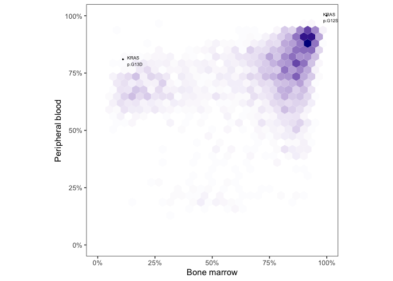

Analyzing initial cmmcs pairs.


```r
source("../2_wgs/0_annotate_samples.R")
dir.create("figures")

paired.participants <- paste0("CTF", 
                              c("001", "002", "003", 
                                "012", "013", "015", "016", "017", "018", "019", 
                                "021", "023", "025", 
                                "034", "036", 
                                "046", "047", "048", 
                                "050", "052", "053", "054", "055", "058"))
```

# Pre-processing

Annotate variants and pivot data with 1 set of column per tissue. Here the difference between samples is tissue in CTCs, BMPCs


```r
ldfr.fixed.protein.change <- read_tsv("../data/phylogic_aggregation_snv_Sept9.tsv")
```

```
## Rows: 232886 Columns: 125
```

```
## ── Column specification ────────────────────────────────────────────────────────
## Delimiter: "\t"
## chr   (9): Patient_ID, Sample_ID, Hugo_Symbol, Reference_Allele, Tumor_Seq_A...
## dbl (113): Chromosome, Start_position, COSMIC_total_alterations_in_gene, t_r...
## lgl   (3): Sample_Alias, Allelic_CN_minor, Allelic_CN_major
```

```
## 
## ℹ Use `spec()` to retrieve the full column specification for this data.
## ℹ Specify the column types or set `show_col_types = FALSE` to quiet this message.
```

```r
ldfr.fixed.protein.change.clinical.annot <- ldfr.fixed.protein.change %>%
  inner_join(clinicaldata, by=c("Sample_ID"="entity:sample_id")) %>%
  mutate(Reclassification=case_when(
    Variant_Classification %in% non.synonymous ~ "Non-Silent",
    Variant_Classification == "Intron" ~ "Intron",
    TRUE ~ "Silent"
  ))

flat.matched.maf <- ldfr.fixed.protein.change.clinical.annot %>%
  filter(isRef==TRUE) %>%
  pivot_wider(id_cols = c(Patient_ID, Stage, Hugo_Symbol, Chromosome, Start_position, Reference_Allele, Tumor_Seq_Allele, Protein_Change, Variant_Classification, Variant_Type, COSMIC_overlapping_mutations, COSMIC_total_alterations_in_gene), names_from = tissue, values_from = c(starts_with("clust_ccf"), preDP_ccf_mean))
```

# Pre-clustering SNV density plot

Annotate post clustering


```r
plot.ccf.density(p.id = "CTF013",
                 maf = flat.matched.maf,
                 maf.labels = TRUE,
                 arrow = FALSE,
                 clustering = c("pre"),
                 n.bins = 30,
                 hex.color = "darkblue",
                 genes.of.interest=genes.of.interest,
                 min.COSMIC.total.alterations.in.gene=10000,
                 non.silent.only=TRUE,
                 save = TRUE,
                 plot = TRUE)
```

```
## Found 2 events to annotate out of 4829 total variants.
```

<!-- -->

# Post-clustering CCF and confidence interval

Using old maf since no forcecalling there!


```r
last.maf <- read_maf("../data/AllRevisions.txt")
annot.maf <- last.maf %>% inner_join(clinicaldata, by=c("Tumor_Sample_Barcode")) %>% filter(isRef==TRUE)

annot.maf$matchedID <- paste0(annot.maf$Hugo_Symbol, " ", annot.maf$Protein_Change, " ", annot.maf$participant)

prep.ccf.matched <- flat.matched.maf %>%
  rowwise() %>%
  mutate(ID=paste0(Hugo_Symbol, " ", Protein_Change, " ", Patient_ID),
         twolinesID=paste0(Hugo_Symbol, " ", Protein_Change, "\n", Patient_ID))

# TODO make this code more efficient
tiny.prep.ccf.matched <-   prep.ccf.matched %>%
  filter(Hugo_Symbol %in% genes.of.interest & Variant_Classification %in% non.synonymous[non.synonymous != "Splice_Site" ] ) %>%
  mutate(is_in_CMMCs = ID %in% subset(annot.maf, tissue=="CMMCs" & participant==Patient_ID)$matchedID,
         is_in_BMPCs = ID %in% subset(annot.maf, tissue=="BMPCs" & participant==Patient_ID)$matchedID,
         CMMC_V = ifelse((!is_in_CMMCs & is_in_BMPCs), "*", ""),
         BMPC_V = ifelse((!is_in_BMPCs & is_in_CMMCs), "*", ""))

tiny.prep.ccf.matched %>%
  filter((clust_ccf_mean_BMPCs<.9|clust_ccf_mean_CMMCs<.9)) %>% # non clonal mutations
  ungroup() %>%
  summarise(Med_BMPCs=median(clust_ccf_mean_BMPCs),
            Med_CMMCs=median(clust_ccf_mean_CMMCs),
            Q25_BMPCs=quantile(clust_ccf_mean_BMPCs, .25),
            Q25_CMMCs=quantile(clust_ccf_mean_CMMCs, .25),
            Q75_BMPCs=quantile(clust_ccf_mean_BMPCs, .75),
            Q75_CMMCs=quantile(clust_ccf_mean_CMMCs, .75))
```

<div class="kable-table">

<table>
 <thead>
  <tr>
   <th style="text-align:right;"> Med_BMPCs </th>
   <th style="text-align:right;"> Med_CMMCs </th>
   <th style="text-align:right;"> Q25_BMPCs </th>
   <th style="text-align:right;"> Q25_CMMCs </th>
   <th style="text-align:right;"> Q75_BMPCs </th>
   <th style="text-align:right;"> Q75_CMMCs </th>
  </tr>
 </thead>
<tbody>
  <tr>
   <td style="text-align:right;"> 0.45 </td>
   <td style="text-align:right;"> 0.59 </td>
   <td style="text-align:right;"> 0.13 </td>
   <td style="text-align:right;"> 0.47 </td>
   <td style="text-align:right;"> 0.57 </td>
   <td style="text-align:right;"> 0.76 </td>
  </tr>
</tbody>
</table>

</div>

