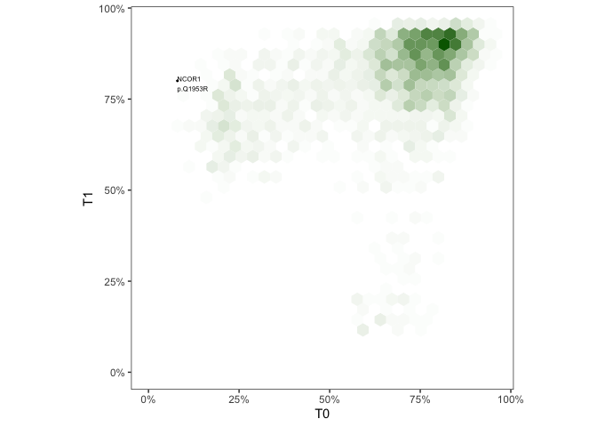
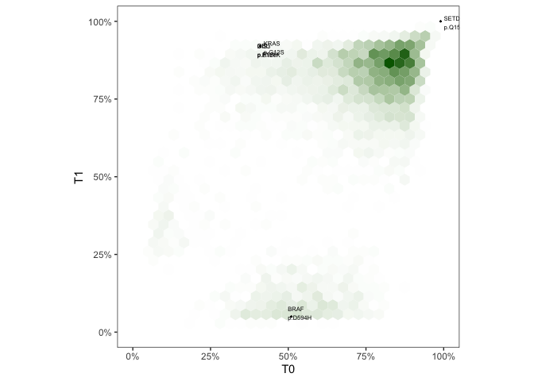

Analyzing initial ctc pairs.


```r
source("../2_wgs/0_annotate_samples.R")
dir.create("figures")

longitudinal.participants <- paste0("CTF", 
                              c("004", "013", "017", "019", "024", "027", "031", "032"))

longitudinal.pal <- c("T0"="#cccccc", "T1"="#FFC2B9")

# for protein change annotation lost in absolute/phylogic
# longitudinal samples part of 1st cohort - no need to go until Sept 9
last.maf <- read_maf("../data/Paper2022_v2_filtered_Mar9.maf")
annot.maf <- last.maf %>% inner_join(clinicaldata, by=c("Tumor_Sample_Barcode")) %>% filter(tissue=="CMMCs")

annot.maf$matchedID <- paste0(annot.maf$Hugo_Symbol, " ", annot.maf$Protein_Change, " ", annot.maf$participant)
```

# Pre-processing

Annotate variants and pivot data with 1 set of column per tissue. Here the difference between samples is tissue in CTCs, BMPCs


```r
ldfr.fixed.protein.change <- read_tsv("../data/phylogic_aggregation_snv_Mar14_longitudinal.tsv")
```

```
## Rows: 95805 Columns: 125
```

```
## ── Column specification ────────────────────────────────────────────────────────
## Delimiter: "\t"
## chr   (9): Patient_ID, Sample_ID, Hugo_Symbol, Reference_Allele, Tumor_Seq_A...
## dbl (113): Chromosome, Start_position, COSMIC_total_alterations_in_gene, t_r...
## lgl   (3): Sample_Alias, Allelic_CN_minor, Allelic_CN_major
```

```
## 
## ℹ Use `spec()` to retrieve the full column specification for this data.
## ℹ Specify the column types or set `show_col_types = FALSE` to quiet this message.
```

```r
# CTF004 was annotated CTF014 in the samplesheet. It is CTF004 longitudinal sampling untreated.
clinicaldata[clinicaldata$`entity:sample_id`=="CTF014_CMMCs_465", "participant"] <- "CTF004"

clinicaldata$Patient_Timepoint <- paste0(clinicaldata$participant, "_", clinicaldata$Timepoint)

ldfr.fixed.protein.change.clinical.annot <- ldfr.fixed.protein.change %>%
  mutate(Patient_Timepoint=str_extract(Sample_ID, "CTF[0-9]{3}_T[0-9]")) %>%
  inner_join(clinicaldata, by=c("Patient_Timepoint")) %>%
  filter(Timepoint %in% c("T0", "T1")) %>% # special hack for CTF019 to be found. + T2
  mutate(Reclassification=case_when(
    Variant_Classification %in% non.synonymous ~ "Non-Silent",
    Variant_Classification == "Intron" ~ "Intron",
    TRUE ~ "Silent"
  ))

flat.matched.maf <- ldfr.fixed.protein.change.clinical.annot %>%
  filter(tissue == "CMMCs") %>%
  pivot_wider(id_cols = c(Patient_ID, Stage, Hugo_Symbol, Chromosome, Start_position, Reference_Allele, Tumor_Seq_Allele, Protein_Change, Variant_Classification, Variant_Type, COSMIC_overlapping_mutations, COSMIC_total_alterations_in_gene), names_from = Timepoint, values_from = c(starts_with("clust_ccf"), preDP_ccf_mean))
```

# Pre-clustering SNV density plot

Annotate post clustering


```r
plot.ccf.density(p.id = "CTF004",
                 maf = flat.matched.maf,
                 maf.labels = TRUE,
                 arrow = FALSE,
                 clustering = c("pre"),
                 x.suffix = "T0",
                 y.suffix = "T1",
                 x.label = "T0",
                 y.label = "T1",
                 n.bins = 30,
                 hex.color = "darkgreen",
                 genes.of.interest=genes.of.interest,
                 min.COSMIC.total.alterations.in.gene=10000,
                 non.silent.only=TRUE,
                 save = TRUE,
                 plot = TRUE)
```

```
## Found 1 events to annotate out of 3052 total variants.
```

<!-- -->

```r
plot.ccf.density(p.id = "CTF032",
                 maf = flat.matched.maf,
                 maf.labels = TRUE,
                 arrow = FALSE,
                 clustering = c("pre"),
                 x.suffix = "T0",
                 y.suffix = "T1",
                 x.label = "T0",
                 y.label = "T1",
                 n.bins = 30,
                 hex.color = "darkgreen",
                 genes.of.interest=genes.of.interest,
                 min.COSMIC.total.alterations.in.gene=10000,
                 non.silent.only=TRUE,
                 save = TRUE,
                 plot = TRUE)
```

```
## Found 5 events to annotate out of 7692 total variants.
```

<!-- -->

# Longitudinal CCF of mutations in MM driver genes


```r
prep.ccf.matched <- flat.matched.maf %>%
  rowwise() %>%
  mutate(ID=paste0(Hugo_Symbol, " ", Protein_Change, " ", Patient_ID),
         twolinesID=paste0(Hugo_Symbol, " ", Protein_Change, "\n", Patient_ID))

prep.ccf.matched <- prep.ccf.matched %>% 
  filter(Variant_Classification %in% non.synonymous & (Hugo_Symbol %in% genes.of.interest ))

# TODO make this code more efficient
# do a table join with dummy variable instead of checking on a loop
prep.ccf.matched <-  prep.ccf.matched %>%
  mutate(is_at_T0 = ID %in% subset(annot.maf, Timepoint=="T0" & participant==Patient_ID)$matchedID,
         is_at_T1 = ID %in% subset(annot.maf, Timepoint=="T1" & participant==Patient_ID)$matchedID,
         T0_V = ifelse((!is_at_T0 & is_at_T1), "*", ""),
         T1_V = ifelse((!is_at_T1 & is_at_T0), "*", ""))

tiny.flat.matched.maf <- prep.ccf.matched %>% 
  filter(Variant_Classification %in% non.synonymous & (Hugo_Symbol %in% genes.of.interest ))
```

## Comparison of CCF post-clustering


```r
long.mut <- tiny.flat.matched.maf %>%
  ggplot(aes(x=fct_reorder(twolinesID, clust_ccf_mean_T0))) +
  geom_bar(aes(y=clust_ccf_mean_T1), fill=longitudinal.pal["T1"], stat = "identity", position=position_nudge(x=0.2), width=0.4) +
  geom_point(aes(y=clust_ccf_mean_T1), fill=longitudinal.pal["T1"], position=position_nudge(x=0.2), size=0.3, color="#444444") +
  geom_linerange(aes(ymin=clust_ccf_CI_low_T1, ymax=clust_ccf_CI_high_T1), size=0.5, position=position_nudge(x=0.2), color="#444444") +
  geom_text(aes(label=T0_V), y=0.02, position=position_nudge(x=0.2), size=3) +
  geom_bar(aes(y=clust_ccf_mean_T0), fill=longitudinal.pal["T0"], stat = "identity", position=position_nudge(x=-0.2), width=0.4) +
  geom_point(aes(y=clust_ccf_mean_T0), fill=longitudinal.pal["T0"], position=position_nudge(x=-0.2), size=0.3) +
  geom_linerange(aes(ymin=clust_ccf_CI_low_T0, ymax=clust_ccf_CI_high_T0), size=0.5, position=position_nudge(x=-0.2), color="#444444") +
  geom_text(aes(label=T1_V), y=0.02, position=position_nudge(x=-0.2), size=3) +
  scale_y_continuous(labels=scales::percent, limits = c(0, 1), expand=expansion(add=c(0, 0.05))) +
  labs(y="Cancer cell fraction", x="", fill="") +
  theme_bw() +
  theme(panel.grid = element_blank(),
        text = element_text(size=7),
        axis.text.x = element_text(angle = 90, hjust=1, vjust = 0.5),
        legend.position = "top")

long.mut
```

<!-- -->

```r
ggsave("figures/longitudinal-mut-drivers-row.pdf", long.mut, width = 4, height = 3)
ggsave("figures/longitudinal-mut-drivers-row..png", long.mut, width = 4, height = 3)
```

